# Agent Architecture

This document details the internal architecture of the memory agent, including the specialized LLM, tool system, and execution engine.

## Agent Core Architecture

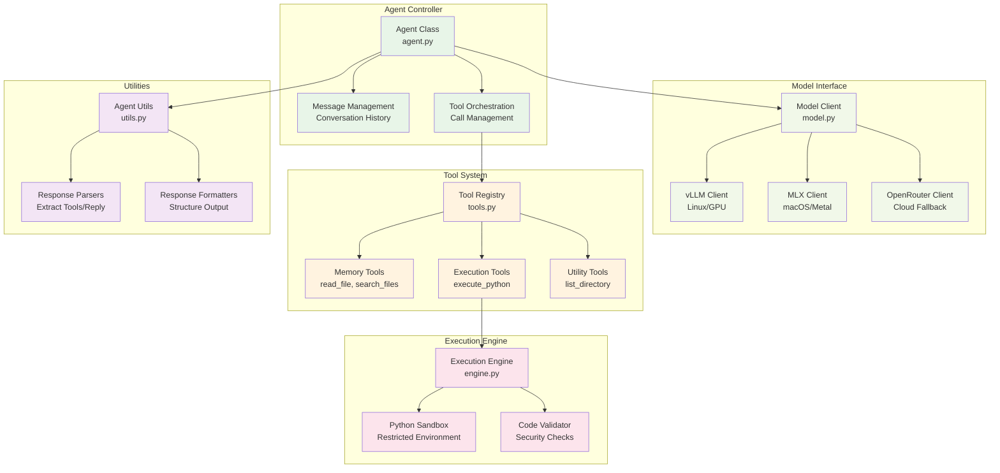

## Memory Agent Specialization

### Dria Fine-tuned Model
The memory agent is based on Dria's specialized fine-tuning for memory management:

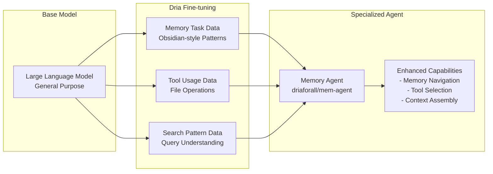

**Model Variants:**
- **4-bit Quantization**: `mem-agent-mlx-4bit` - High efficiency for macOS
- **8-bit Quantization**: `mem-agent-mlx-8bit` - Balanced performance/quality  
- **bf16 Precision**: `driaforall/mem-agent-mlx-bf16` - Full precision for accuracy

### System Prompt Architecture
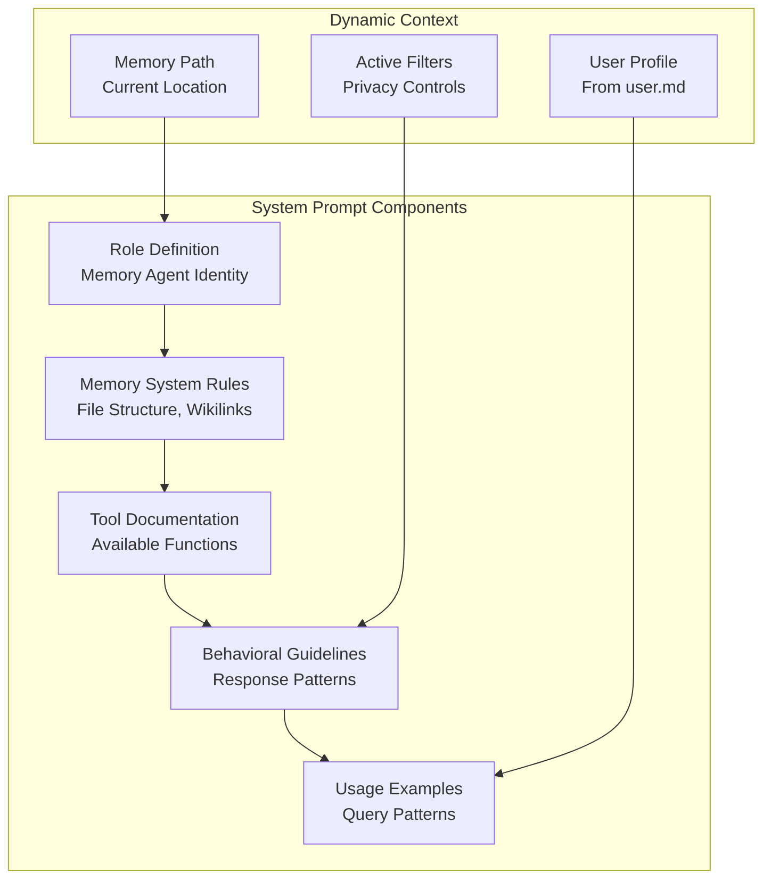

## Tool System Architecture

### Tool Registry Implementation
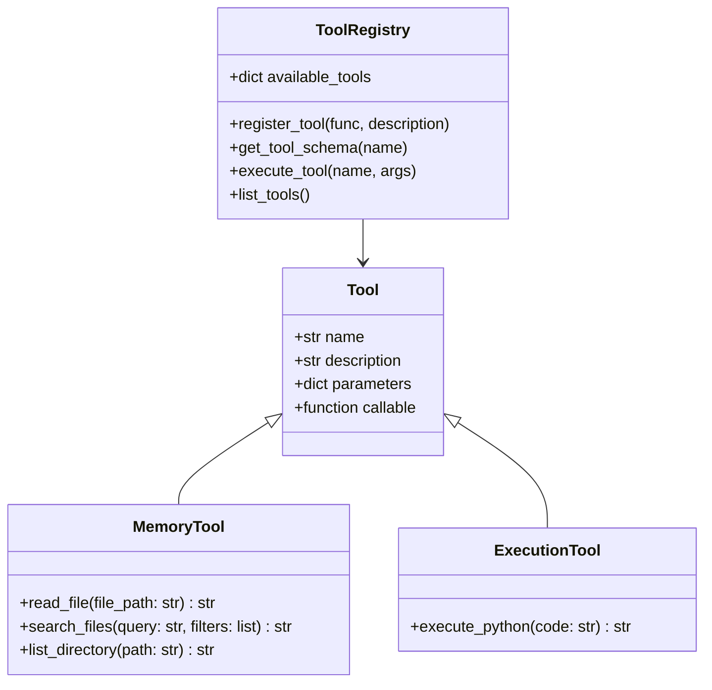

### Memory Tools Detail

#### `read_file` Tool
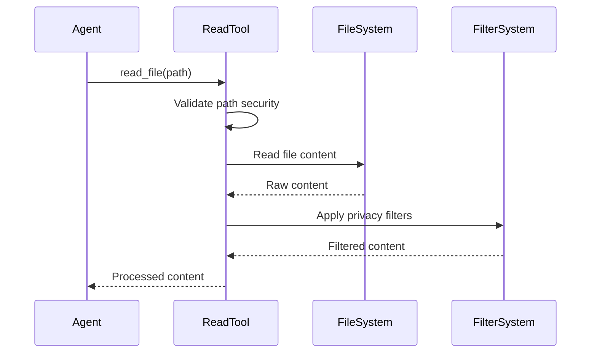

**Security Features:**
- Path traversal prevention
- File extension validation
- Size limits for large files
- Privacy filter application

#### `search_files` Tool  
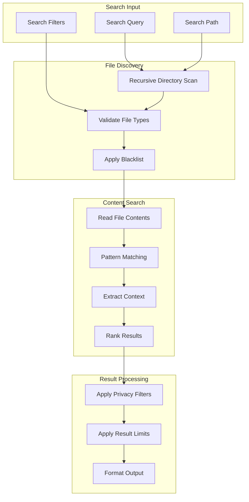

**Search Features:**
- Regular expression support
- Case-insensitive matching
- Context window extraction
- Relevance scoring
- Result limits and pagination

#### `execute_python` Tool
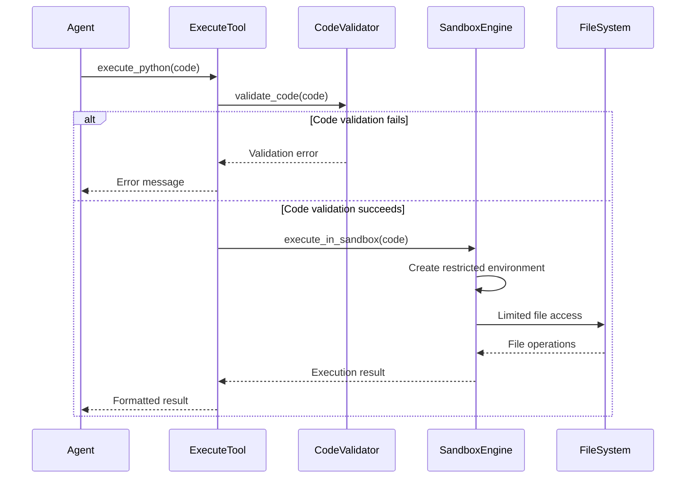

## Execution Engine Architecture

### Sandboxed Code Execution
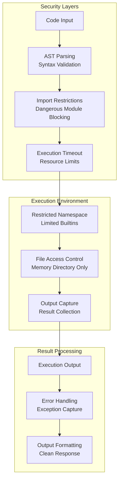

### Security Restrictions
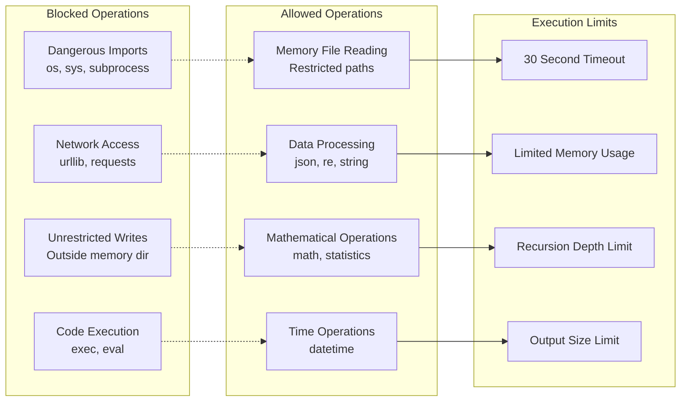

## Conversation Management

### Message Flow Architecture
```mermaid
sequenceDiagram
    participant Client
    participant Agent
    participant MessageQueue
    participant ModelClient
    participant ToolSystem
    
    Client->>Agent: User Query
    Agent->>MessageQueue: Add user message
    Agent->>MessageQueue: Add system prompt
    
    loop Conversation Turn
        Agent->>ModelClient: Send message history
        ModelClient-->>Agent: Model response
        Agent->>MessageQueue: Add assistant message
        
        alt Response contains tool calls
            Agent->>ToolSystem: Execute tools
            ToolSystem-->>Agent: Tool results
            Agent->>MessageQueue: Add tool results
        else Response is final
            break
        end
    end
    
    Agent->>Agent: Extract final response
    Agent-->>Client: Formatted response
```

### Conversation State Management
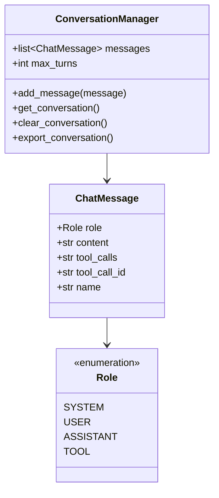

## Response Processing Architecture

### Response Extraction Pipeline
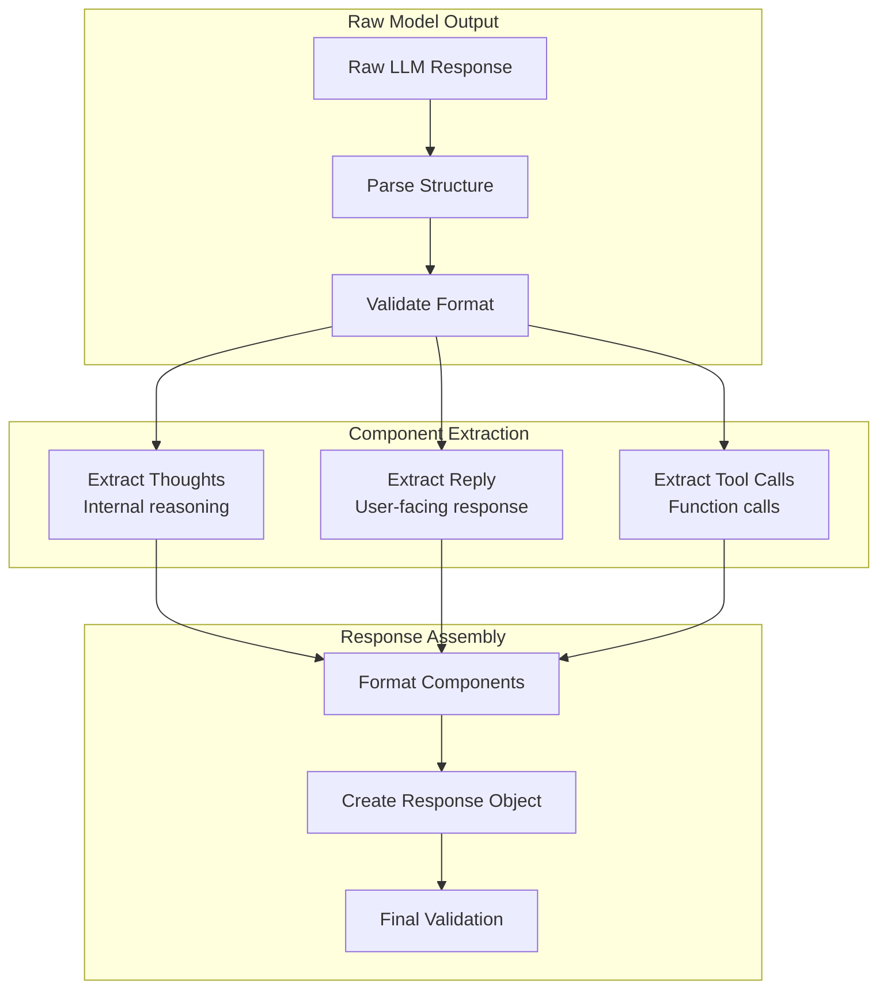

### Response Format Structure
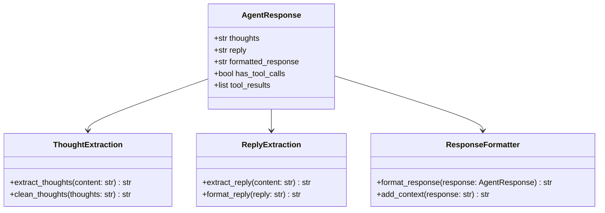

## Performance and Optimization

### Model Selection Logic
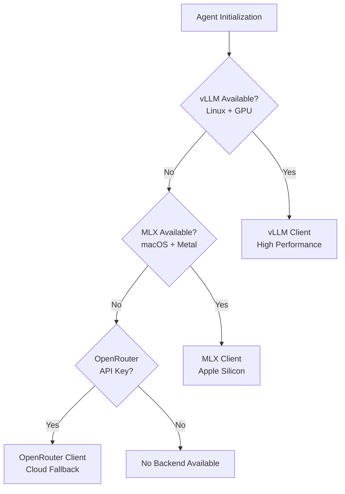

### Memory and Performance Characteristics

#### Tool Execution Performance
- **File Reading**: O(1) for individual files, cached content
- **Directory Scanning**: O(n) linear with file count
- **Search Operations**: O(n*m) with content size and pattern complexity
- **Code Execution**: Limited by sandbox overhead and timeout

#### Memory Usage Patterns
- **Conversation History**: Grows linearly with turns, managed by max_turns
- **File Content Caching**: LRU cache for frequently accessed files
- **Model Context**: Limited by model context window (typically 4K-32K tokens)
- **Tool Results**: Temporary storage, cleared after response

## Next Steps

For related architecture documentation:
- [MCP Server Architecture](./mcp-server-architecture.md) - MCP protocol implementation
- [Memory System Architecture](./memory-system-architecture.md) - Memory storage and organization
- [Deployment Architecture](./deployment-architecture.md) - Deployment patterns and configuration