# API Architecture

This document details the API design, protocol specifications, and integration patterns for the mem-agent-mcp system.

## API Overview


## Model Context Protocol (MCP) API

### MCP Protocol Specification


### MCP Tool Schema


**MCP Tool Definitions:**

#### Read Memory Files Tool
```json
{
  "name": "read_memory_files",
  "description": "Read content from memory markdown files",
  "parameters": {
    "type": "object",
    "properties": {
      "files": {
        "type": "array",
        "items": {"type": "string"},
        "description": "List of memory file paths to read",
        "minItems": 1,
        "maxItems": 10
      }
    },
    "required": ["files"]
  }
}
```

#### Search Files Tool
```json
{
  "name": "search_files", 
  "description": "Search through memory files with optional filters",
  "parameters": {
    "type": "object",
    "properties": {
      "query": {
        "type": "string",
        "description": "Search query or pattern",
        "minLength": 1,
        "maxLength": 500
      },
      "max_results": {
        "type": "integer",
        "description": "Maximum number of results to return",
        "minimum": 1,
        "maximum": 50,
        "default": 10
      },
      "file_pattern": {
        "type": "string",
        "description": "File pattern filter (glob)",
        "default": "*.md"
      }
    },
    "required": ["query"]
  }
}
```

### MCP Message Format


**Standard MCP Error Codes:**
```json
{
  "PARSE_ERROR": -32700,
  "INVALID_REQUEST": -32600,
  "METHOD_NOT_FOUND": -32601,
  "INVALID_PARAMS": -32602,
  "INTERNAL_ERROR": -32603,
  "TOOL_EXECUTION_ERROR": -32000,
  "MEMORY_ACCESS_ERROR": -32001,
  "AGENT_ERROR": -32002
}
```

## HTTP API Specification

### HTTP API Endpoints


### HTTP API Request/Response Flow


### API Authentication and Security


### OpenAPI Specification
```yaml
openapi: 3.0.3
info:
  title: mem-agent-mcp API
  description: Memory Agent MCP Server HTTP API
  version: 1.0.0
  
servers:
  - url: http://localhost:8081
    description: Local development server
    
paths:
  /mcp:
    post:
      summary: MCP over HTTP endpoint
      description: Model Context Protocol requests over HTTP
      requestBody:
        required: true
        content:
          application/json:
            schema:
              $ref: '#/components/schemas/MCPRequest'
      responses:
        200:
          description: MCP response
          content:
            application/json:
              schema:
                $ref: '#/components/schemas/MCPResponse'
        400:
          description: Invalid request
        500:
          description: Server error
          
  /api/memory/search:
    post:
      summary: Search memory files
      description: Search through memory files with filters
      requestBody:
        required: true
        content:
          application/json:
            schema:
              type: object
              properties:
                query:
                  type: string
                  description: Search query
                max_results:
                  type: integer
                  minimum: 1
                  maximum: 50
                  default: 10
                filters:
                  type: array
                  items:
                    type: string
              required: [query]
      responses:
        200:
          description: Search results
          content:
            application/json:
              schema:
                type: object
                properties:
                  results:
                    type: array
                    items:
                      $ref: '#/components/schemas/SearchResult'
                  total:
                    type: integer
                  query_time:
                    type: number
                    
components:
  schemas:
    MCPRequest:
      type: object
      properties:
        jsonrpc:
          type: string
          enum: ["2.0"]
        method:
          type: string
        params:
          type: object
        id:
          type: string
      required: [jsonrpc, method, id]
      
    MCPResponse:
      type: object
      properties:
        jsonrpc:
          type: string
          enum: ["2.0"]
        result:
          type: object
        error:
          $ref: '#/components/schemas/MCPError'
        id:
          type: string
      required: [jsonrpc, id]
      
    MCPError:
      type: object
      properties:
        code:
          type: integer
        message:
          type: string
        data:
          type: object
      required: [code, message]
      
    SearchResult:
      type: object
      properties:
        file_path:
          type: string
        content:
          type: string
        score:
          type: number
        context:
          type: string
      required: [file_path, content, score]
```

## Internal API Architecture

### Agent API


### Tool API Specification


### Memory API Operations


## Protocol Implementations

### STDIO Transport


### HTTP Transport  

```mermaid
graph TB
    subgraph "HTTP Server"
        FASTAPI[FastAPI Application<br/>ASGI framework]
        MIDDLEWARE[Middleware Stack<br/>CORS, logging, auth]
        ROUTING[Request Routing<br/>Path-based routing]
    end
    
    subgraph "Request Processing"
        PARSER[Request Parser<br/>JSON, form data]
        VALIDATOR[Request Validator<br/>Schema validation]
        CONVERTER[Format Converter<br/>HTTP ↔ MCP]
    end
    
    subgraph "Response Handling"
        FORMATTER[Response Formatter<br/>JSON serialization]
        ERROR_HANDLER[Error Handler<br/>Exception mapping]
        HEADERS[Header Management<br/>CORS, security]
    end
    
    FASTAPI --> MIDDLEWARE
    MIDDLEWARE --> ROUTING
    ROUTING --> PARSER
    
    PARSER --> VALIDATOR
    VALIDATOR --> CONVERTER
    CONVERTER --> FORMATTER
    
    FORMATTER --> ERROR_HANDLER
    ERROR_HANDLER --> HEADERS
```


### WebSocket Transport (Future)


## Data Serialization and Validation

### JSON Schema Validation


### Message Serialization


## Error Handling and Status Codes

### API Error Classification


### Error Response Format
```json
{
  "jsonrpc": "2.0",
  "error": {
    "code": -32001,
    "message": "Memory access error",
    "data": {
      "error_type": "FileNotFoundError",
      "error_details": "Memory file not found: entities/missing.md",
      "suggested_action": "Check file path and ensure file exists",
      "timestamp": "2024-01-15T10:30:00Z",
      "request_id": "req_123456"
    }
  },
  "id": "call_123"
}
```

## Rate Limiting and Throttling

### Rate Limiting Strategy


### API Usage Metrics


## Client SDK and Integration

### Python Client SDK
```python
class MemAgentMCPClient:
    def __init__(self, transport: str = "stdio", 
                 host: str = "localhost", 
                 port: int = 8081):
        self.transport = transport
        self.host = host  
        self.port = port
        self._session = None
    
    async def read_memory_files(self, files: List[str]) -> Dict:
        """Read content from memory files"""
        return await self._call_tool("read_memory_files", {"files": files})
    
    async def search_files(self, query: str, max_results: int = 10) -> Dict:
        """Search through memory files"""
        params = {"query": query, "max_results": max_results}
        return await self._call_tool("search_files", params)
    
    async def _call_tool(self, method: str, params: Dict) -> Dict:
        """Generic tool call method"""
        if self.transport == "stdio":
            return await self._stdio_call(method, params)
        elif self.transport == "http":
            return await self._http_call(method, params)
        else:
            raise ValueError(f"Unsupported transport: {self.transport}")
```

### JavaScript Client SDK
```javascript
class MemAgentMCPClient {
  constructor(options = {}) {
    this.transport = options.transport || 'http';
    this.baseURL = options.baseURL || 'http://localhost:8081';
    this.timeout = options.timeout || 30000;
  }
  
  async readMemoryFiles(files) {
    return this.callTool('read_memory_files', { files });
  }
  
  async searchFiles(query, maxResults = 10) {
    return this.callTool('search_files', { 
      query, 
      max_results: maxResults 
    });
  }
  
  async callTool(method, params) {
    const response = await fetch(`${this.baseURL}/mcp`, {
      method: 'POST',
      headers: { 'Content-Type': 'application/json' },
      body: JSON.stringify({
        jsonrpc: '2.0',
        method: method,
        params: params,
        id: this.generateId()
      })
    });
    
    const result = await response.json();
    if (result.error) {
      throw new Error(result.error.message);
    }
    return result.result;
  }
}
```

## API Versioning and Evolution

### API Versioning Strategy


## Next Steps

For implementation details:
- [MCP Server Architecture](./mcp-server-architecture.md) - MCP protocol implementation
- [Agent Architecture](./agent-architecture.md) - Agent processing details  
- [Memory System Architecture](./memory-system-architecture.md) - Memory operations
- [Memory Connectors Architecture](./memory-connectors-architecture.md) - Data integration APIs