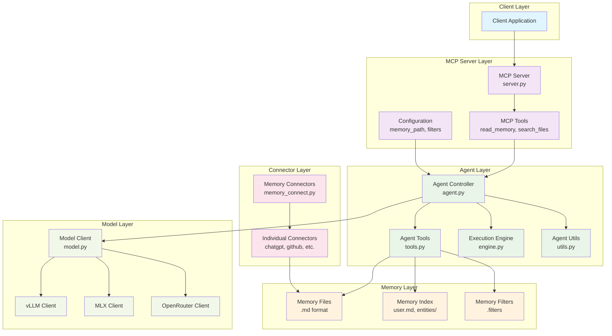
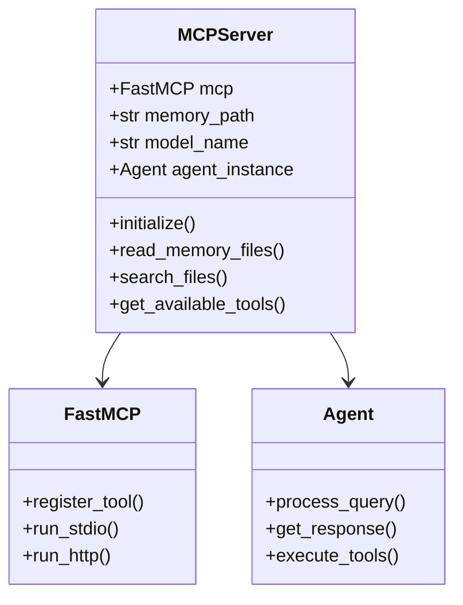
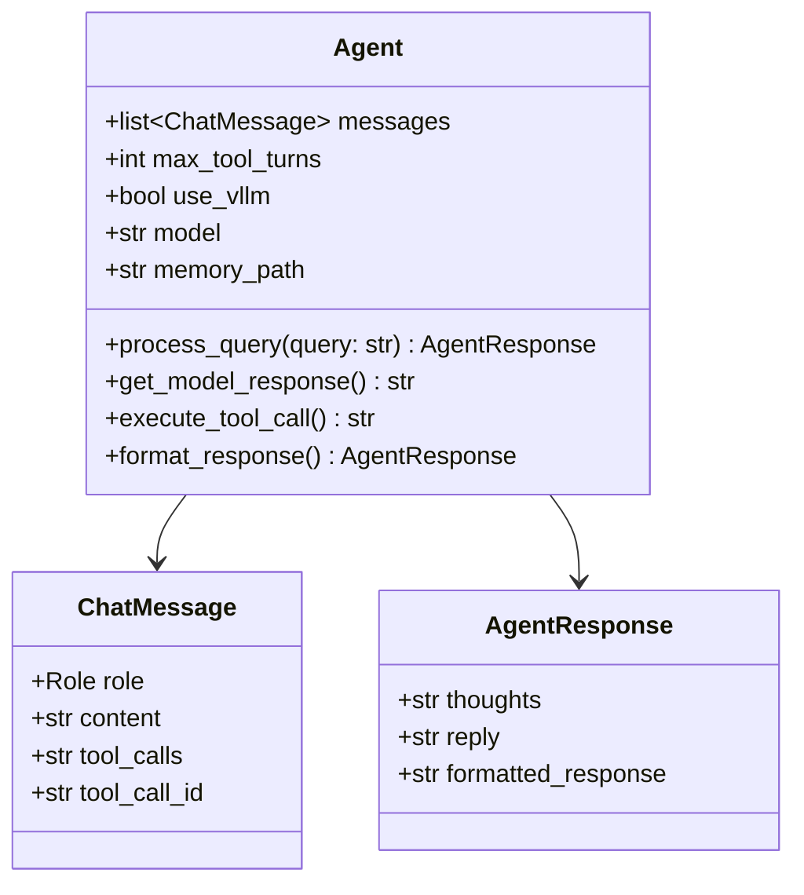
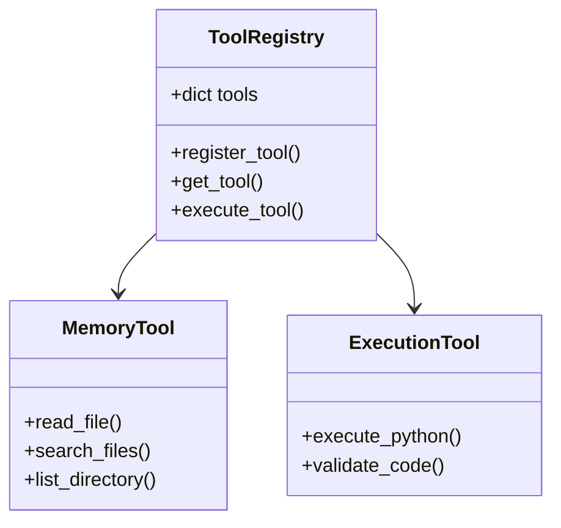
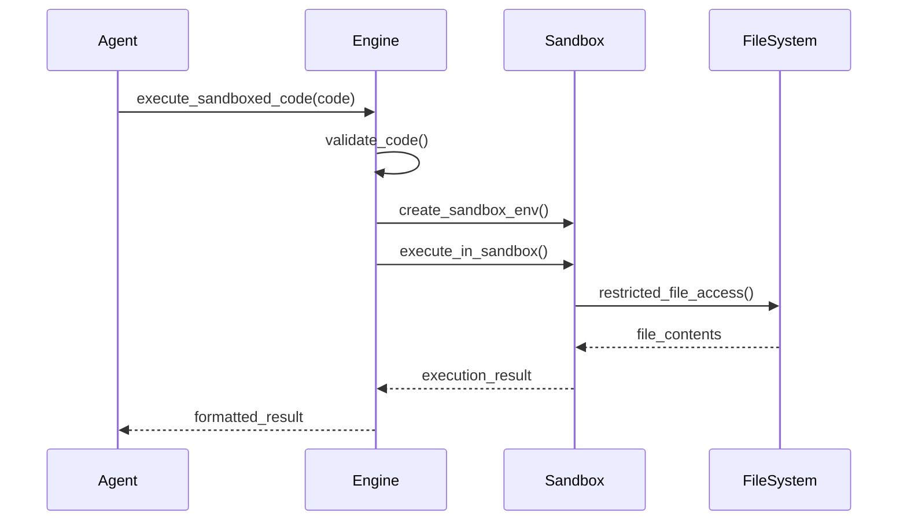
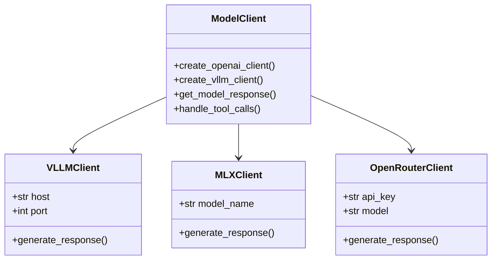
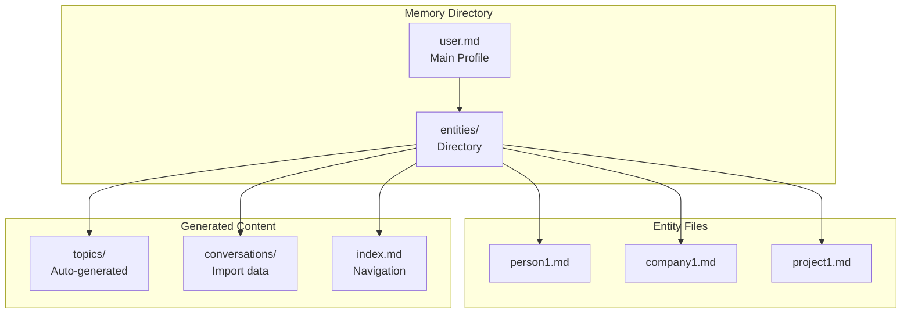
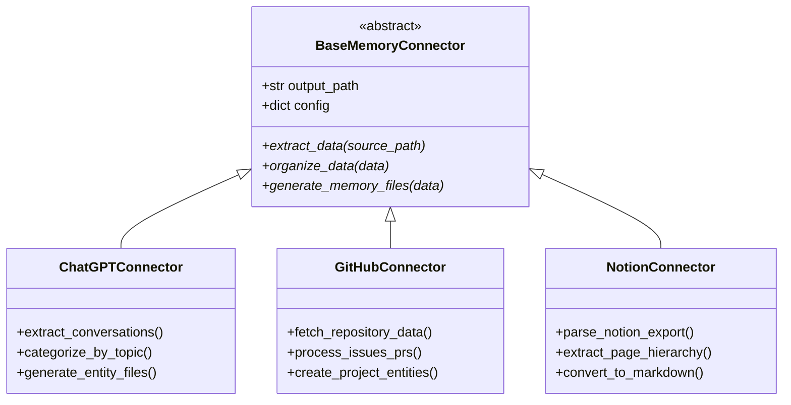
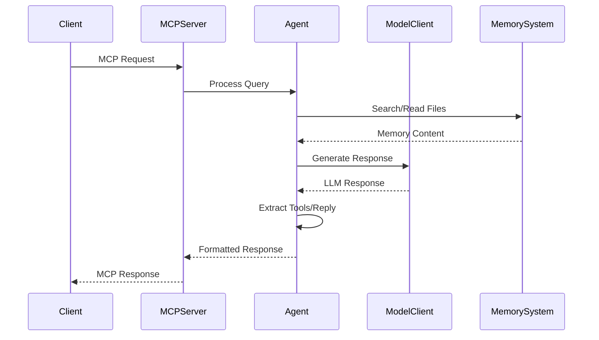
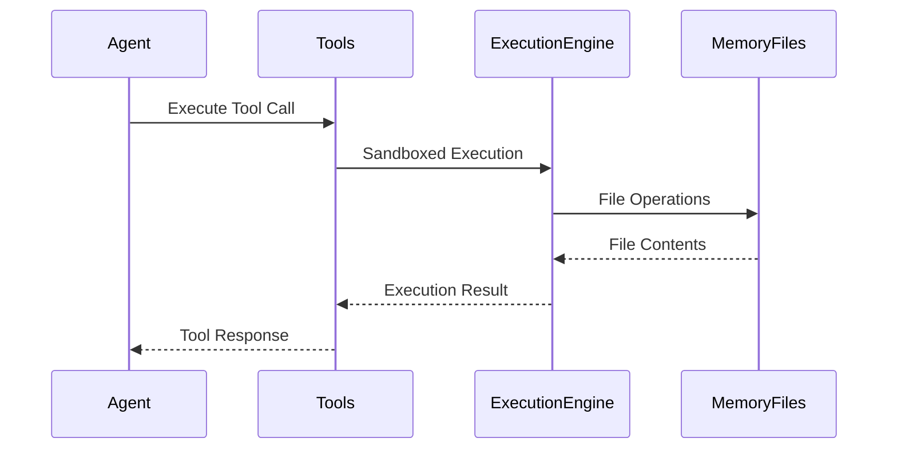

# Component Architecture

This document details the internal architecture and interactions between components in the mem-agent-mcp system.

## Component Interaction Overview

## Detailed Component Specifications

### MCP Server Components

#### MCP Server (`mcp_server/server.py`)

**Key Responsibilities:**
- MCP protocol implementation using FastMCP
- Tool registration and execution
- Client request routing to agent
- Memory path configuration management

#### MCP Tools
- `read_memory_files`: Read and parse memory markdown files
- `search_files`: Search across memory files with filters
- Configuration management for memory path and filters

### Agent Components  

#### Agent Controller (`agent/agent.py`)

**Key Responsibilities:**
- Query processing and conversation management
- Tool orchestration and execution
- Model interaction coordination
- Response formatting and extraction

#### Agent Tools (`agent/tools.py`)

**Available Tools:**
- `read_file`: Read memory markdown files
- `search_files`: Search with filters and patterns
- `list_directory`: Navigate memory structure
- `execute_python`: Sandboxed code execution

#### Execution Engine (`agent/engine.py`)

**Security Features:**
- Sandboxed Python code execution
- Restricted file system access
- Import restrictions and validation
- Output capturing and formatting

### Model Layer Components

#### Model Client (`agent/model.py`)

**Backend Selection Logic:**
1. Check for vLLM configuration (Linux/GPU)
2. Check for MLX model availability (macOS)
3. Fallback to OpenRouter (cloud inference)

### Memory System Components

#### Memory Organization

**Memory Structure:**
- `user.md`: Central profile with relationship links
- `entities/`: Individual entity files with relationships
- Wikilink format: `[[entities/entity_name.md]]`
- Auto-generated topic organization
- Cross-referenced navigation

### Memory Connector Components

#### Connector Architecture

**Connector Types:**
- **Export-based**: Process ZIP/JSON exports (ChatGPT, Notion, Nuclino)
- **Live API**: Real-time data sync (GitHub, Google Docs)
- **Categorization**: AI-powered topic organization
- **Entity Extraction**: Automatic relationship mapping

## Component Communication Patterns

### Request Flow

### Tool Execution Flow

## Configuration and Settings

### Environment Variables
- `MEMORY_DIR`: Memory directory path
- `FASTMCP_LOG_LEVEL`: Logging level
- `MCP_TRANSPORT`: Transport protocol (stdio/http)
- `VLLM_HOST`, `VLLM_PORT`: vLLM configuration
- `OPENROUTER_API_KEY`: Cloud inference fallback

### Configuration Files
- `.memory_path`: Memory directory location
- `.filters`: Privacy and content filters  
- `.mlx_model_name`: MLX model selection
- `mcp.json`: MCP client configuration

## Next Steps

For more detailed documentation:
- [Data Flow Architecture](./data-flow-architecture.md) - Request processing flows
- [Agent Architecture](./agent-architecture.md) - Agent implementation details
- [Memory System Architecture](./memory-system-architecture.md) - Memory organization