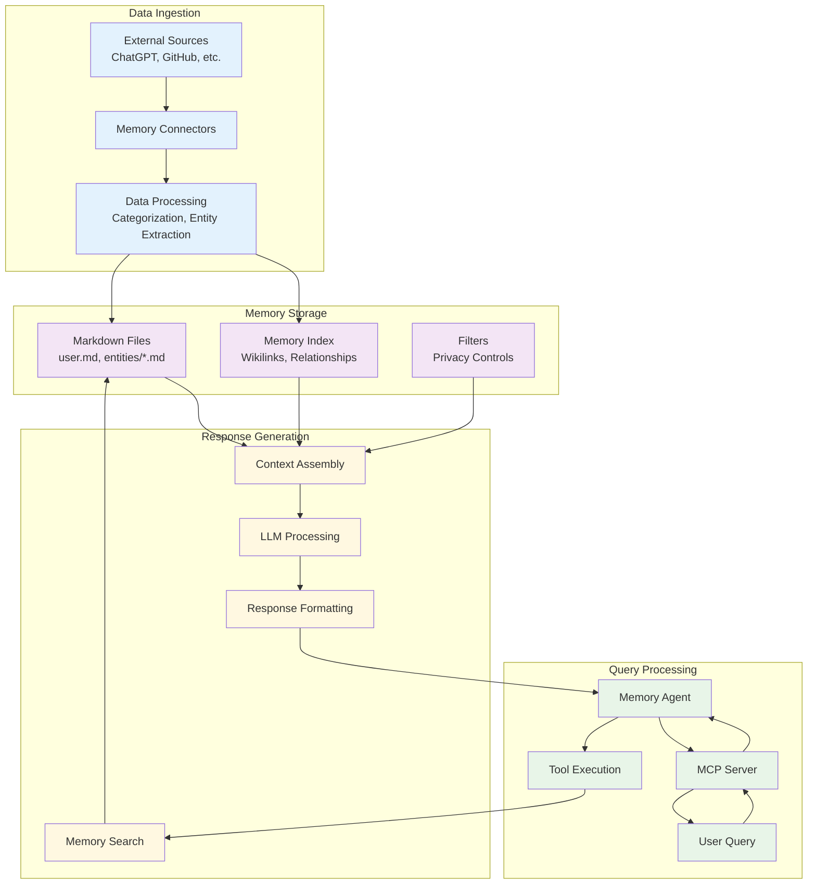
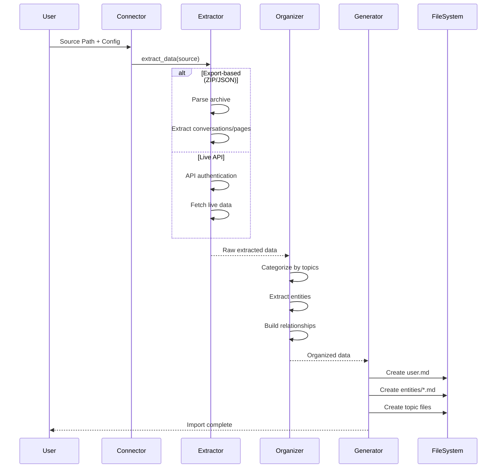
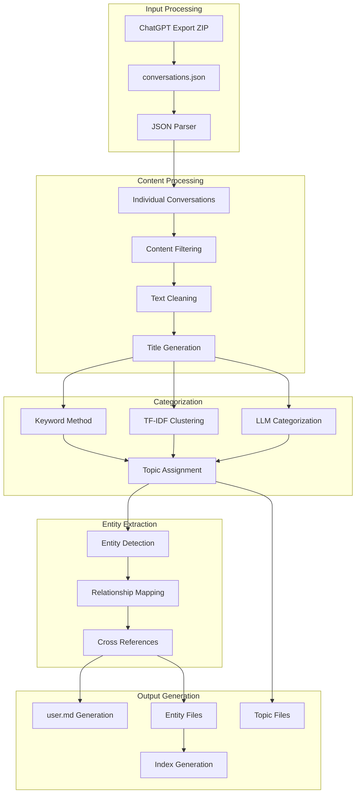
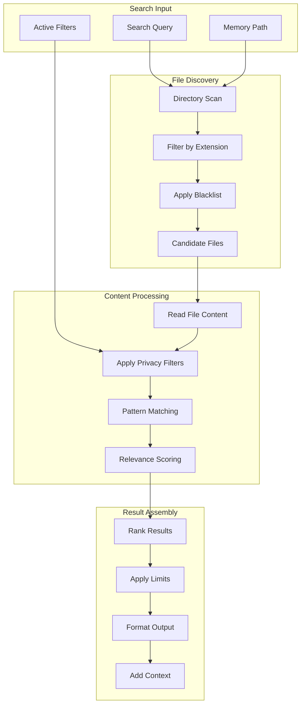
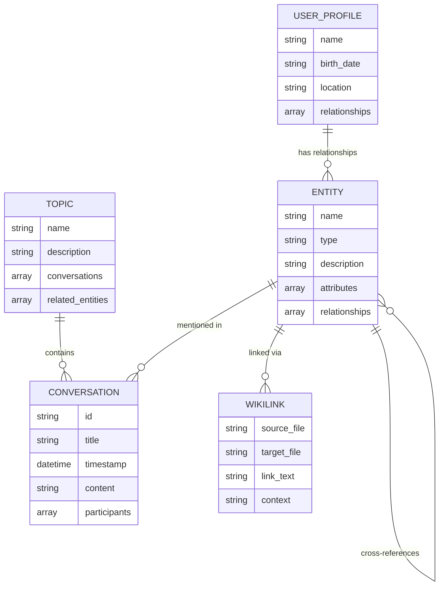
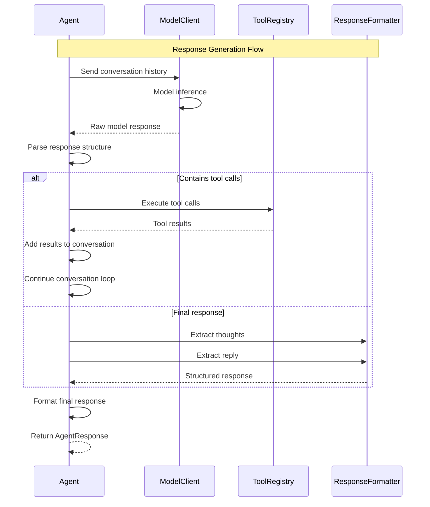
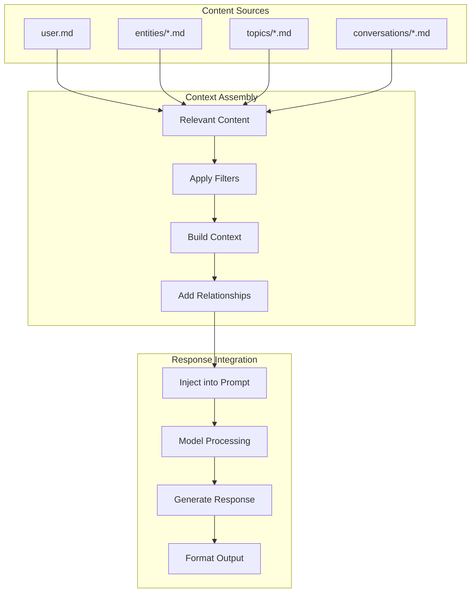
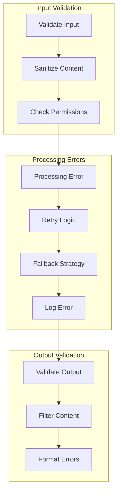

# Data Flow Architecture

This document describes the data flow patterns, processing pipelines, and information movement throughout the mem-agent-mcp system.

## System Data Flow Overview



## Detailed Data Flow Patterns

### 1. Data Ingestion Pipeline

#### Memory Connector Data Flow


#### ChatGPT History Processing


### 2. Query Processing Pipeline

#### MCP Request Processing
```mermaid
sequenceDiagram
    participant Client
    participant MCPServer
    participant Agent
    participant Tools
    participant Memory
    participant ModelBackend
    
    Note over Client,ModelBackend: Query Processing Flow
    
    Client->>MCPServer: MCP Request (read_memory/search)
    MCPServer->>MCPServer: Parse MCP protocol
    MCPServer->>Agent: Initialize with query
    
    Agent->>Agent: Load system prompt
    Agent->>Agent: Add query to conversation
    
    loop Tool Execution Loop (max_tool_turns)
        Agent->>ModelBackend: Generate response
        ModelBackend-->>Agent: Response with tool calls
        
        alt Tool calls present
            Agent->>Tools: Execute tool calls
            Tools->>Memory: File operations
            Memory-->>Tools: Memory content
            Tools-->>Agent: Tool results
            Agent->>Agent: Add to conversation
        else No tool calls
            break
        end
    end
    
    Agent->>Agent: Extract final response
    Agent-->>MCPServer: Formatted response
    MCPServer-->>Client: MCP Response
```

#### Memory Search Data Flow


### 3. Memory Organization Data Structures

#### Memory File Relationships


#### Memory Storage Format
```mermaid
graph TD
    subgraph "user.md Structure"
        USER_HEADER[# User Information]
        USER_ATTRS[- user_name<br/>- birth_date<br/>- location]
        USER_REL_HEADER[## User Relationships]
        USER_LINKS[- company: [[entities/company.md]]<br/>- friend: [[entities/person.md]]]
    end
    
    subgraph "Entity File Structure"
        ENT_HEADER[# Entity Name]
        ENT_ATTRS[- relationship: type<br/>- attr1: value<br/>- attr2: value]
        ENT_CONTENT[## Content/Description]
        ENT_LINKS[## Related Links<br/>[[entities/other.md]]]
    end
    
    subgraph "Topic File Structure"
        TOPIC_HEADER[# Topic Name]
        TOPIC_DESC[Brief description of topic]
        TOPIC_CONVS[## Conversations<br/>- [[conversations/conv1.md]]<br/>- [[conversations/conv2.md]]]
        TOPIC_ENTITIES[## Related Entities<br/>- [[entities/person1.md]]<br/>- [[entities/project1.md]]]
    end
    
    USER_HEADER --> USER_ATTRS
    USER_ATTRS --> USER_REL_HEADER
    USER_REL_HEADER --> USER_LINKS
    
    ENT_HEADER --> ENT_ATTRS
    ENT_ATTRS --> ENT_CONTENT
    ENT_CONTENT --> ENT_LINKS
    
    TOPIC_HEADER --> TOPIC_DESC
    TOPIC_DESC --> TOPIC_CONVS
    TOPIC_CONVS --> TOPIC_ENTITIES
```

### 4. Response Generation Pipeline

#### Agent Response Processing


#### Memory Content Assembly


### 5. Error Handling and Data Validation

#### Error Flow Management


## Data Consistency and Integrity

### Memory Synchronization
- **Real-time Updates**: Memory files can be modified without server restart
- **Index Regeneration**: Automatic relationship updating on file changes
- **Conflict Resolution**: Last-write-wins for concurrent modifications
- **Backup Strategy**: Original data preservation during connector imports

### Data Validation Rules
- **Wikilink Integrity**: Validate all `[[entity/file.md]]` references
- **Schema Validation**: Ensure proper markdown structure
- **Content Filtering**: Apply privacy filters before processing
- **Relationship Consistency**: Bidirectional relationship validation

## Performance Characteristics

### Throughput Patterns
- **Memory Search**: O(n) file scanning with content filtering
- **Context Assembly**: Limited by model context window
- **Connector Processing**: Batch processing with progress tracking
- **Response Generation**: Model inference latency dominates

### Caching Strategies
- **File Content Caching**: In-memory caching of frequently accessed files
- **Search Result Caching**: Cache search patterns and results
- **Model Response Caching**: Optional response caching for repeated queries

## Next Steps

For implementation details:
- [Agent Architecture](./agent-architecture.md) - Agent processing implementation
- [Memory System Architecture](./memory-system-architecture.md) - Memory storage details
- [API Architecture](./api-architecture.md) - API and protocol specifications