# Deployment Architecture

This document covers deployment patterns, configurations, and platform-specific considerations for the mem-agent-mcp system.

## Deployment Overview

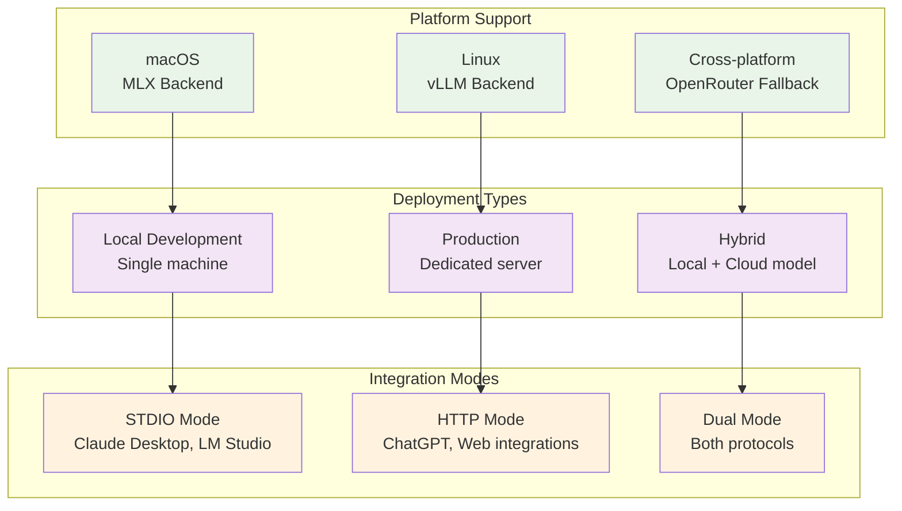
```mermaid
graph TB
    subgraph "Platform Support"
        MACOS[macOS<br/>MLX Backend]
        LINUX[Linux<br/>vLLM Backend]
        CROSS[Cross-platform<br/>OpenRouter Fallback]
    end
    
    subgraph "Deployment Types"
        LOCAL[Local Development<br/>Single machine]
        PRODUCTION[Production<br/>Dedicated server]
        HYBRID[Hybrid<br/>Local + Cloud model]
    end
    
    subgraph "Integration Modes"
        STDIO_MODE[STDIO Mode<br/>Claude Desktop, LM Studio]
        HTTP_MODE[HTTP Mode<br/>ChatGPT, Web integrations]
        DUAL_MODE[Dual Mode<br/>Both protocols]
    end
    
    MACOS --> LOCAL
    LINUX --> PRODUCTION
    CROSS --> HYBRID
    
    LOCAL --> STDIO_MODE
    PRODUCTION --> HTTP_MODE
    HYBRID --> DUAL_MODE
    
    %% Styling
    classDef platform fill:#e8f5e8
    classDef deployment fill:#f3e5f5
    classDef integration fill:#fff3e0
    
    class MACOS,LINUX,CROSS platform
    class LOCAL,PRODUCTION,HYBRID deployment
    class STDIO_MODE,HTTP_MODE,DUAL_MODE integration
```

## Platform-Specific Deployments

### macOS Deployment (MLX Backend)
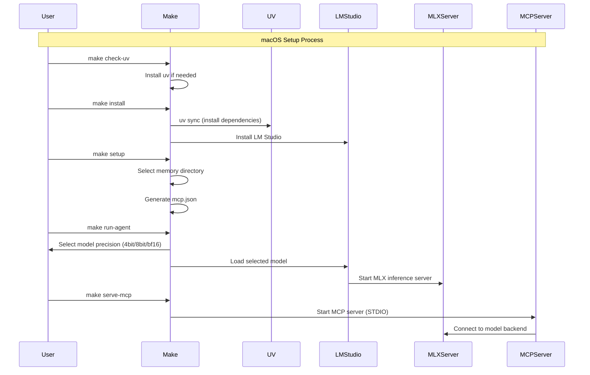
```mermaid
sequenceDiagram
    participant User
    participant Make
    participant UV
    participant LMStudio
    participant MLXServer
    participant MCPServer
    
    Note over User,MCPServer: macOS Setup Process
    
    User->>Make: make check-uv
    Make->>Make: Install uv if needed
    
    User->>Make: make install
    Make->>UV: uv sync (install dependencies)
    Make->>LMStudio: Install LM Studio
    
    User->>Make: make setup
    Make->>Make: Select memory directory
    Make->>Make: Generate mcp.json
    
    User->>Make: make run-agent
    Make->>User: Select model precision (4bit/8bit/bf16)
    Make->>LMStudio: Load selected model
    LMStudio->>MLXServer: Start MLX inference server
    
    User->>Make: make serve-mcp
    Make->>MCPServer: Start MCP server (STDIO)
    MCPServer->>MLXServer: Connect to model backend
```

**macOS Architecture:**
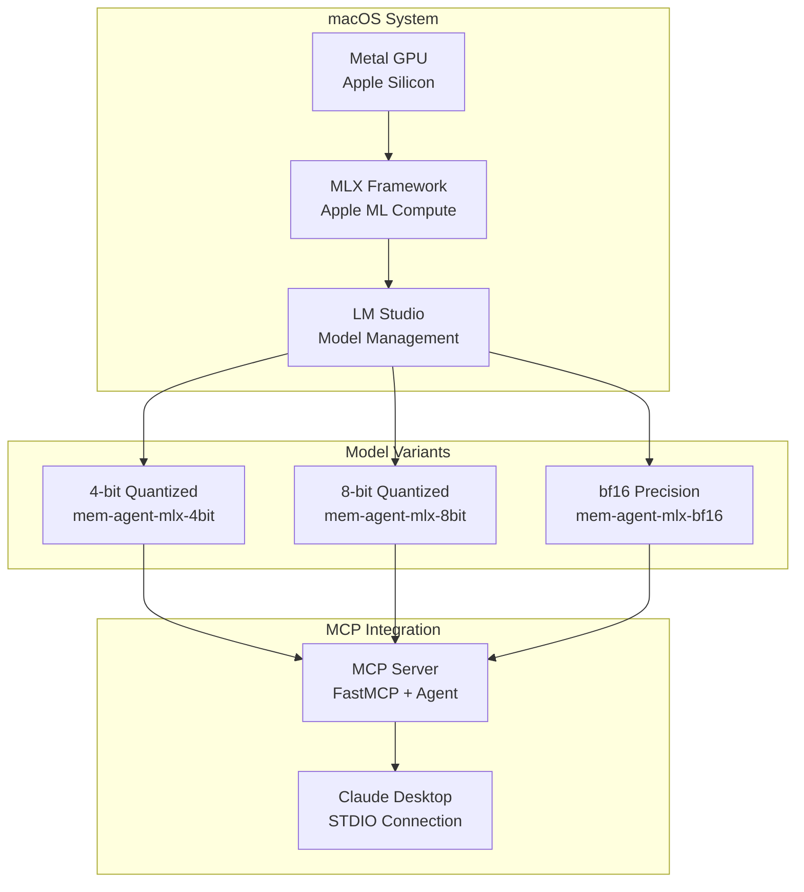
```mermaid
graph TB
    subgraph "macOS System"
        METAL[Metal GPU<br/>Apple Silicon]
        MLX_FRAMEWORK[MLX Framework<br/>Apple ML Compute]
        LM_STUDIO[LM Studio<br/>Model Management]
    end
    
    subgraph "Model Variants"
        MODEL_4BIT[4-bit Quantized<br/>mem-agent-mlx-4bit]
        MODEL_8BIT[8-bit Quantized<br/>mem-agent-mlx-8bit]
        MODEL_BF16[bf16 Precision<br/>mem-agent-mlx-bf16]
    end
    
    subgraph "MCP Integration"
        CLAUDE_DESKTOP[Claude Desktop<br/>STDIO Connection]
        MCP_SERVER[MCP Server<br/>FastMCP + Agent]
    end
    
    METAL --> MLX_FRAMEWORK
    MLX_FRAMEWORK --> LM_STUDIO
    LM_STUDIO --> MODEL_4BIT
    LM_STUDIO --> MODEL_8BIT
    LM_STUDIO --> MODEL_BF16
    
    MODEL_4BIT --> MCP_SERVER
    MODEL_8BIT --> MCP_SERVER
    MODEL_BF16 --> MCP_SERVER
    
    MCP_SERVER --> CLAUDE_DESKTOP
```

### Linux Deployment (vLLM Backend)
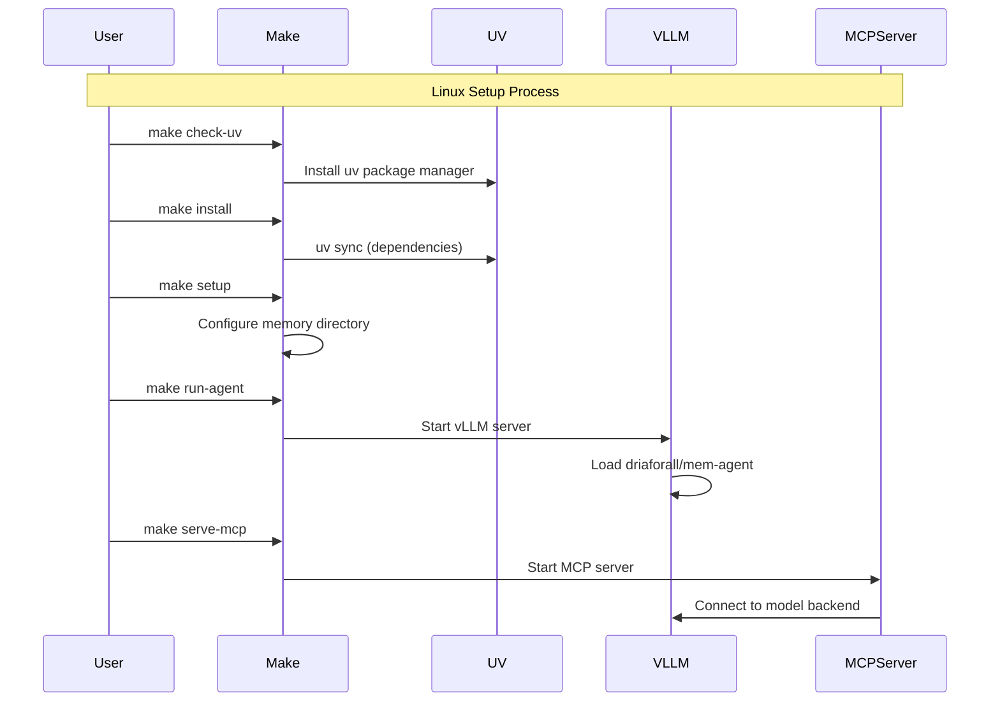
```mermaid
sequenceDiagram
    participant User
    participant Make
    participant UV
    participant VLLM
    participant MCPServer
    
    Note over User,MCPServer: Linux Setup Process
    
    User->>Make: make check-uv
    Make->>UV: Install uv package manager
    
    User->>Make: make install
    Make->>UV: uv sync (dependencies)
    
    User->>Make: make setup
    Make->>Make: Configure memory directory
    
    User->>Make: make run-agent
    Make->>VLLM: Start vLLM server
    VLLM->>VLLM: Load driaforall/mem-agent
    
    User->>Make: make serve-mcp
    Make->>MCPServer: Start MCP server
    MCPServer->>VLLM: Connect to model backend
```

**Linux Architecture:**
```mermaid
graph TB
    subgraph "Linux System"
        GPU[NVIDIA GPU<br/>CUDA Support]
        VLLM_ENGINE[vLLM Engine<br/>High-performance Inference]
        DOCKER[Docker<br/>Optional Containerization]
    end
    
    subgraph "Model Service"
        MODEL_SERVER[vLLM Server<br/>driaforall/mem-agent]
        QUANTIZATION[Model Quantization<br/>Optional optimization]
        API_ENDPOINT[OpenAI-compatible API<br/>localhost:8000]
    end
    
    subgraph "MCP Services"
        MCP_STDIO[MCP STDIO Server<br/>Terminal integrations]
        MCP_HTTP[MCP HTTP Server<br/>Web integrations]
        NGINX[Nginx<br/>Reverse proxy (optional)]
    end
    
    GPU --> VLLM_ENGINE
    VLLM_ENGINE --> MODEL_SERVER
    DOCKER --> MODEL_SERVER
    
    MODEL_SERVER --> QUANTIZATION
    QUANTIZATION --> API_ENDPOINT
    API_ENDPOINT --> MCP_STDIO
    API_ENDPOINT --> MCP_HTTP
    
    MCP_HTTP --> NGINX
```

### Cross-Platform Deployment (Cloud Fallback)
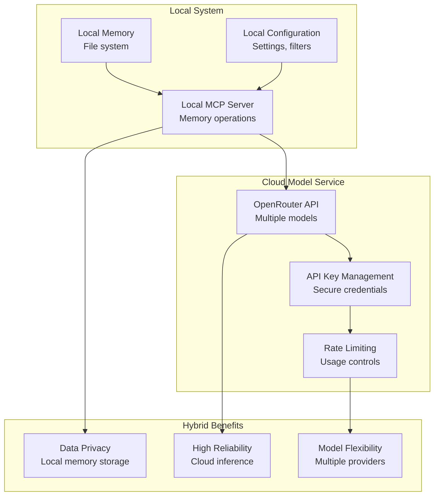
```mermaid
graph TB
    subgraph "Local System"
        LOCAL_MCP[Local MCP Server<br/>Memory operations]
        LOCAL_MEMORY[Local Memory<br/>File system]
        LOCAL_CONFIG[Local Configuration<br/>Settings, filters]
    end
    
    subgraph "Cloud Model Service"
        OPENROUTER[OpenRouter API<br/>Multiple models]
        API_KEY[API Key Management<br/>Secure credentials]
        RATE_LIMITS[Rate Limiting<br/>Usage controls]
    end
    
    subgraph "Hybrid Benefits"
        PRIVACY[Data Privacy<br/>Local memory storage]
        RELIABILITY[High Reliability<br/>Cloud inference]
        FLEXIBILITY[Model Flexibility<br/>Multiple providers]
    end
    
    LOCAL_MCP --> OPENROUTER
    LOCAL_MEMORY --> LOCAL_MCP
    LOCAL_CONFIG --> LOCAL_MCP
    
    OPENROUTER --> API_KEY
    API_KEY --> RATE_LIMITS
    
    LOCAL_MCP --> PRIVACY
    OPENROUTER --> RELIABILITY
    RATE_LIMITS --> FLEXIBILITY
```

## Container Deployment

### Docker Configuration
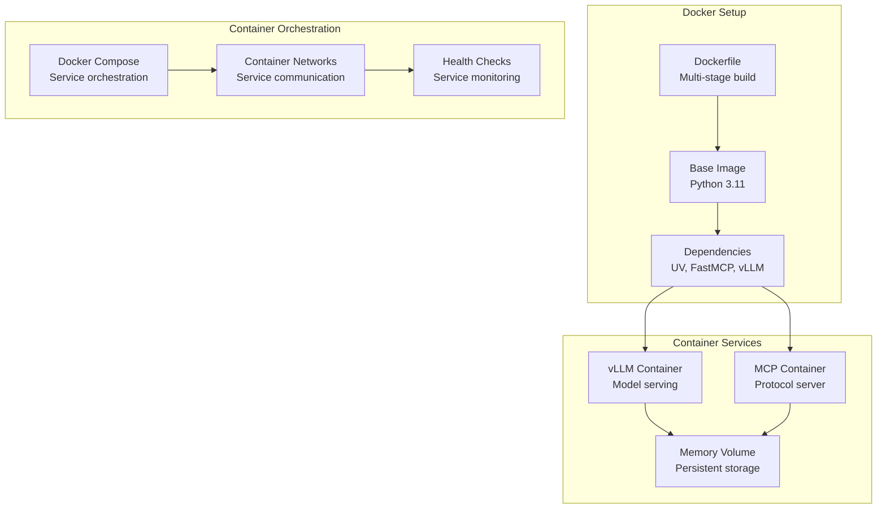
```mermaid
graph TB
    subgraph "Docker Setup"
        DOCKERFILE[Dockerfile<br/>Multi-stage build]
        BASE_IMAGE[Base Image<br/>Python 3.11]
        DEPS[Dependencies<br/>UV, FastMCP, vLLM]
    end
    
    subgraph "Container Services"
        VLLM_CONTAINER[vLLM Container<br/>Model serving]
        MCP_CONTAINER[MCP Container<br/>Protocol server]
        MEMORY_VOLUME[Memory Volume<br/>Persistent storage]
    end
    
    subgraph "Container Orchestration"
        COMPOSE[Docker Compose<br/>Service orchestration]
        NETWORKS[Container Networks<br/>Service communication]
        HEALTH_CHECKS[Health Checks<br/>Service monitoring]
    end
    
    DOCKERFILE --> BASE_IMAGE
    BASE_IMAGE --> DEPS
    DEPS --> VLLM_CONTAINER
    DEPS --> MCP_CONTAINER
    
    VLLM_CONTAINER --> MEMORY_VOLUME
    MCP_CONTAINER --> MEMORY_VOLUME
    
    COMPOSE --> NETWORKS
    NETWORKS --> HEALTH_CHECKS
```

**Docker Compose Example:**
```yaml
version: '3.8'
services:
  vllm-server:
    build:
      context: .
      dockerfile: Dockerfile.vllm
    ports:
      - "8000:8000"
    volumes:
      - model_cache:/root/.cache/huggingface
    environment:
      - CUDA_VISIBLE_DEVICES=0
    deploy:
      resources:
        reservations:
          devices:
            - driver: nvidia
              count: 1
              capabilities: [gpu]
  
  mcp-server:
    build:
      context: .
      dockerfile: Dockerfile.mcp
    ports:
      - "8081:8081"
    volumes:
      - ./memory:/app/memory
      - ./.filters:/app/.filters
    environment:
      - VLLM_HOST=vllm-server
      - VLLM_PORT=8000
      - MEMORY_DIR=/app/memory
    depends_on:
      - vllm-server

volumes:
  model_cache:
```

### Kubernetes Deployment
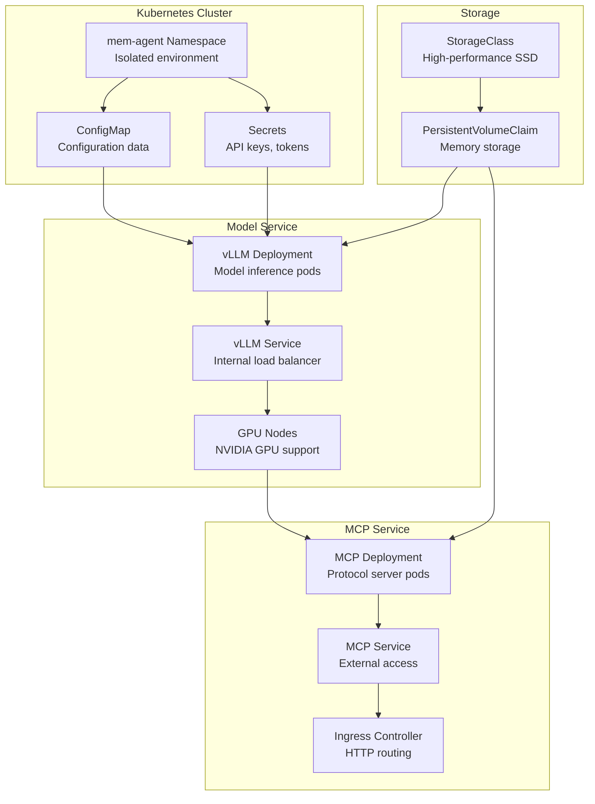
```mermaid
graph TB
    subgraph "Kubernetes Cluster"
        NAMESPACE[mem-agent Namespace<br/>Isolated environment]
        CONFIGMAP[ConfigMap<br/>Configuration data]
        SECRETS[Secrets<br/>API keys, tokens]
    end
    
    subgraph "Model Service"
        VLLM_DEPLOY[vLLM Deployment<br/>Model inference pods]
        VLLM_SERVICE[vLLM Service<br/>Internal load balancer]
        GPU_NODES[GPU Nodes<br/>NVIDIA GPU support]
    end
    
    subgraph "MCP Service"
        MCP_DEPLOY[MCP Deployment<br/>Protocol server pods]
        MCP_SERVICE[MCP Service<br/>External access]
        INGRESS[Ingress Controller<br/>HTTP routing]
    end
    
    subgraph "Storage"
        PVC[PersistentVolumeClaim<br/>Memory storage]
        STORAGE_CLASS[StorageClass<br/>High-performance SSD]
    end
    
    NAMESPACE --> CONFIGMAP
    NAMESPACE --> SECRETS
    CONFIGMAP --> VLLM_DEPLOY
    SECRETS --> VLLM_DEPLOY
    
    VLLM_DEPLOY --> VLLM_SERVICE
    VLLM_SERVICE --> GPU_NODES
    GPU_NODES --> MCP_DEPLOY
    
    MCP_DEPLOY --> MCP_SERVICE
    MCP_SERVICE --> INGRESS
    
    PVC --> VLLM_DEPLOY
    PVC --> MCP_DEPLOY
    STORAGE_CLASS --> PVC
```

## Client Integration Configurations

### Claude Desktop Configuration
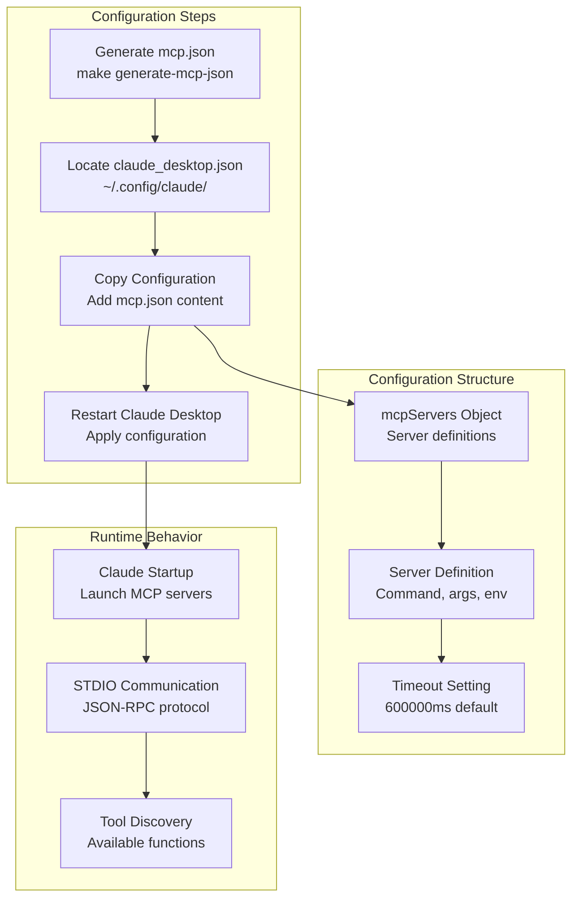
```mermaid
graph TB
    subgraph "Configuration Steps"
        GENERATE[Generate mcp.json<br/>make generate-mcp-json]
        LOCATE[Locate claude_desktop.json<br/>~/.config/claude/]
        COPY[Copy Configuration<br/>Add mcp.json content]
        RESTART[Restart Claude Desktop<br/>Apply configuration]
    end
    
    subgraph "Configuration Structure"
        MCP_SERVERS[mcpServers Object<br/>Server definitions]
        SERVER_DEF[Server Definition<br/>Command, args, env]
        TIMEOUT[Timeout Setting<br/>600000ms default]
    end
    
    subgraph "Runtime Behavior"
        STARTUP[Claude Startup<br/>Launch MCP servers]
        STDIO[STDIO Communication<br/>JSON-RPC protocol]
        TOOLS[Tool Discovery<br/>Available functions]
    end
    
    GENERATE --> LOCATE
    LOCATE --> COPY
    COPY --> RESTART
    
    COPY --> MCP_SERVERS
    MCP_SERVERS --> SERVER_DEF
    SERVER_DEF --> TIMEOUT
    
    RESTART --> STARTUP
    STARTUP --> STDIO
    STDIO --> TOOLS
```

### ChatGPT Integration Setup
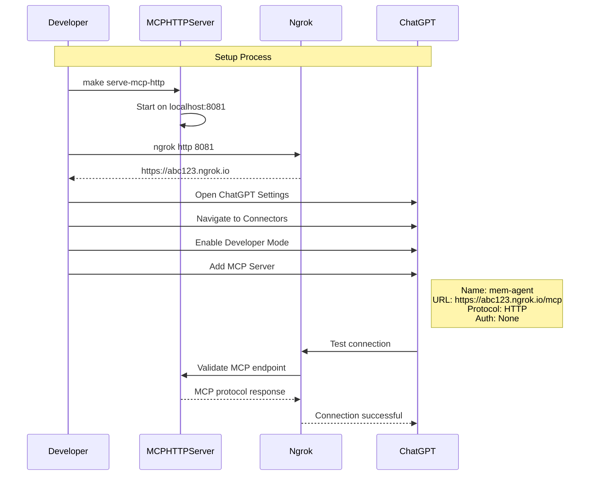
```mermaid
sequenceDiagram
    participant Developer
    participant MCPHTTPServer
    participant Ngrok
    participant ChatGPT
    
    Note over Developer,ChatGPT: Setup Process
    
    Developer->>MCPHTTPServer: make serve-mcp-http
    MCPHTTPServer->>MCPHTTPServer: Start on localhost:8081
    
    Developer->>Ngrok: ngrok http 8081
    Ngrok-->>Developer: https://abc123.ngrok.io
    
    Developer->>ChatGPT: Open ChatGPT Settings
    Developer->>ChatGPT: Navigate to Connectors
    Developer->>ChatGPT: Enable Developer Mode
    
    Developer->>ChatGPT: Add MCP Server
    Note right of ChatGPT: Name: mem-agent<br/>URL: https://abc123.ngrok.io/mcp<br/>Protocol: HTTP<br/>Auth: None
    
    ChatGPT->>Ngrok: Test connection
    Ngrok->>MCPHTTPServer: Validate MCP endpoint
    MCPHTTPServer-->>Ngrok: MCP protocol response
    Ngrok-->>ChatGPT: Connection successful
```

## Environment Management

### Development Environment
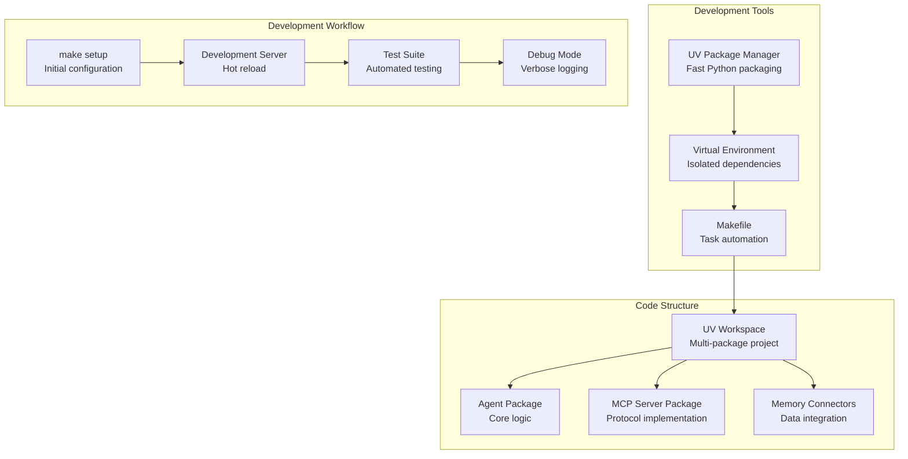
```mermaid
graph TB
    subgraph "Development Tools"
        UV[UV Package Manager<br/>Fast Python packaging]
        VENV[Virtual Environment<br/>Isolated dependencies]
        MAKE[Makefile<br/>Task automation]
    end
    
    subgraph "Code Structure"
        WORKSPACE[UV Workspace<br/>Multi-package project]
        AGENT_PKG[Agent Package<br/>Core logic]
        MCP_PKG[MCP Server Package<br/>Protocol implementation]
        MEMORY_PKG[Memory Connectors<br/>Data integration]
    end
    
    subgraph "Development Workflow"
        SETUP[make setup<br/>Initial configuration]
        DEV_SERVER[Development Server<br/>Hot reload]
        TESTING[Test Suite<br/>Automated testing]
        DEBUGGING[Debug Mode<br/>Verbose logging]
    end
    
    UV --> VENV
    VENV --> MAKE
    MAKE --> WORKSPACE
    
    WORKSPACE --> AGENT_PKG
    WORKSPACE --> MCP_PKG
    WORKSPACE --> MEMORY_PKG
    
    SETUP --> DEV_SERVER
    DEV_SERVER --> TESTING
    TESTING --> DEBUGGING
```

### Production Environment
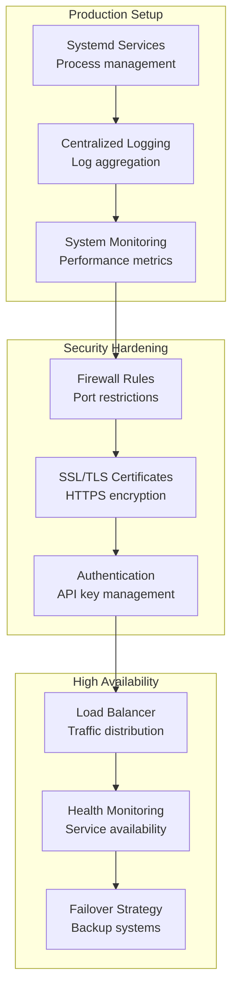
```mermaid
graph TB
    subgraph "Production Setup"
        SYSTEMD[Systemd Services<br/>Process management]
        LOGGING[Centralized Logging<br/>Log aggregation]
        MONITORING[System Monitoring<br/>Performance metrics]
    end
    
    subgraph "Security Hardening"
        FIREWALL[Firewall Rules<br/>Port restrictions]
        SSL[SSL/TLS Certificates<br/>HTTPS encryption]
        AUTH[Authentication<br/>API key management]
    end
    
    subgraph "High Availability"
        LOAD_BALANCER[Load Balancer<br/>Traffic distribution]
        HEALTH_CHECK[Health Monitoring<br/>Service availability]
        FAILOVER[Failover Strategy<br/>Backup systems]
    end
    
    SYSTEMD --> LOGGING
    LOGGING --> MONITORING
    MONITORING --> FIREWALL
    
    FIREWALL --> SSL
    SSL --> AUTH
    AUTH --> LOAD_BALANCER
    
    LOAD_BALANCER --> HEALTH_CHECK
    HEALTH_CHECK --> FAILOVER
```

## Configuration Management

### Configuration Hierarchy
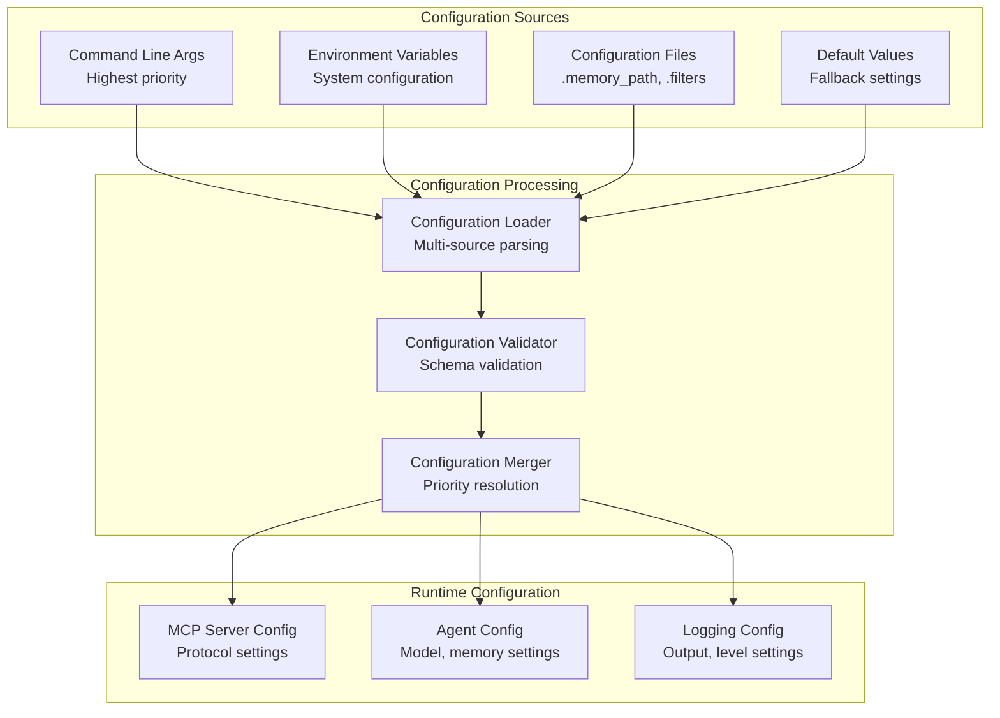
```mermaid
graph TB
    subgraph "Configuration Sources"
        CLI_ARGS[Command Line Args<br/>Highest priority]
        ENV_VARS[Environment Variables<br/>System configuration]
        CONFIG_FILES[Configuration Files<br/>.memory_path, .filters]
        DEFAULTS[Default Values<br/>Fallback settings]
    end
    
    subgraph "Configuration Processing"
        LOADER[Configuration Loader<br/>Multi-source parsing]
        VALIDATOR[Configuration Validator<br/>Schema validation]
        MERGER[Configuration Merger<br/>Priority resolution]
    end
    
    subgraph "Runtime Configuration"
        MCP_CONFIG[MCP Server Config<br/>Protocol settings]
        AGENT_CONFIG[Agent Config<br/>Model, memory settings]
        LOGGING_CONFIG[Logging Config<br/>Output, level settings]
    end
    
    CLI_ARGS --> LOADER
    ENV_VARS --> LOADER
    CONFIG_FILES --> LOADER
    DEFAULTS --> LOADER
    
    LOADER --> VALIDATOR
    VALIDATOR --> MERGER
    MERGER --> MCP_CONFIG
    MERGER --> AGENT_CONFIG
    MERGER --> LOGGING_CONFIG
```

### Environment Variables
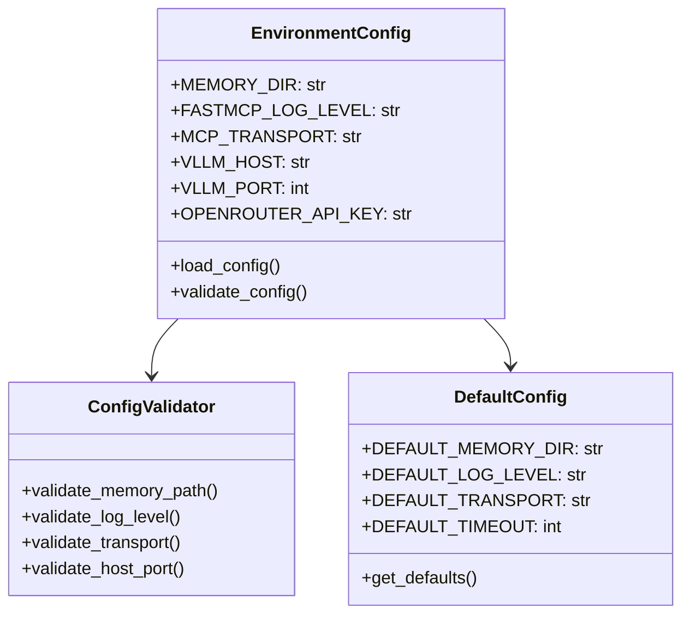
```mermaid
classDiagram
    class EnvironmentConfig {
        +MEMORY_DIR: str
        +FASTMCP_LOG_LEVEL: str
        +MCP_TRANSPORT: str
        +VLLM_HOST: str
        +VLLM_PORT: int
        +OPENROUTER_API_KEY: str
        +load_config()
        +validate_config()
    }
    
    class ConfigValidator {
        +validate_memory_path()
        +validate_log_level()
        +validate_transport()
        +validate_host_port()
    }
    
    class DefaultConfig {
        +DEFAULT_MEMORY_DIR: str
        +DEFAULT_LOG_LEVEL: str
        +DEFAULT_TRANSPORT: str
        +DEFAULT_TIMEOUT: int
        +get_defaults()
    }
    
    EnvironmentConfig --> ConfigValidator
    EnvironmentConfig --> DefaultConfig
```

## Monitoring and Observability

### Logging Architecture
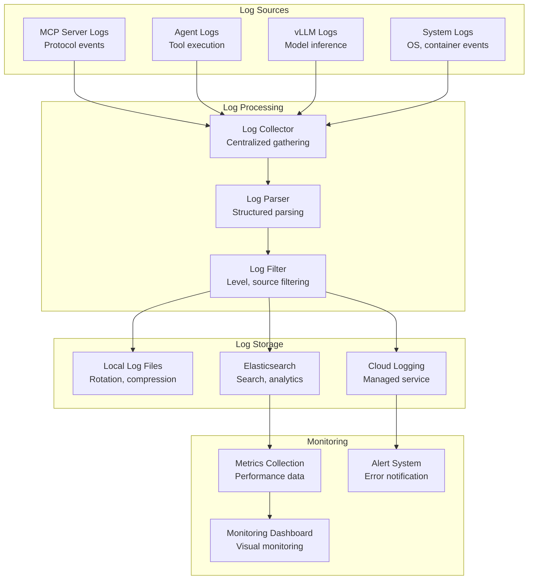
```mermaid
graph TB
    subgraph "Log Sources"
        MCP_LOGS[MCP Server Logs<br/>Protocol events]
        AGENT_LOGS[Agent Logs<br/>Tool execution]
        VLLM_LOGS[vLLM Logs<br/>Model inference]
        SYSTEM_LOGS[System Logs<br/>OS, container events]
    end
    
    subgraph "Log Processing"
        COLLECTOR[Log Collector<br/>Centralized gathering]
        PARSER[Log Parser<br/>Structured parsing]
        FILTER[Log Filter<br/>Level, source filtering]
    end
    
    subgraph "Log Storage"
        LOCAL_FILES[Local Log Files<br/>Rotation, compression]
        ELASTICSEARCH[Elasticsearch<br/>Search, analytics]
        CLOUD_LOGS[Cloud Logging<br/>Managed service]
    end
    
    subgraph "Monitoring"
        METRICS[Metrics Collection<br/>Performance data]
        ALERTS[Alert System<br/>Error notification]
        DASHBOARD[Monitoring Dashboard<br/>Visual monitoring]
    end
    
    MCP_LOGS --> COLLECTOR
    AGENT_LOGS --> COLLECTOR
    VLLM_LOGS --> COLLECTOR
    SYSTEM_LOGS --> COLLECTOR
    
    COLLECTOR --> PARSER
    PARSER --> FILTER
    FILTER --> LOCAL_FILES
    FILTER --> ELASTICSEARCH
    FILTER --> CLOUD_LOGS
    
    ELASTICSEARCH --> METRICS
    CLOUD_LOGS --> ALERTS
    METRICS --> DASHBOARD
```

### Performance Monitoring
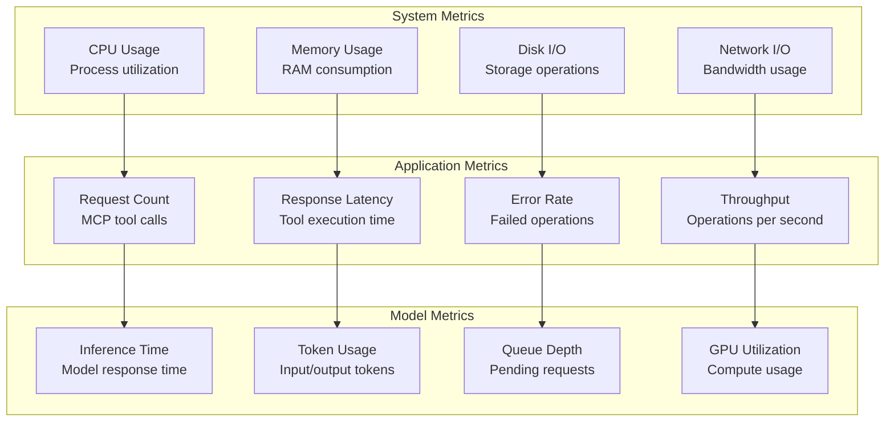
```mermaid
graph TB
    subgraph "System Metrics"
        CPU[CPU Usage<br/>Process utilization]
        MEMORY[Memory Usage<br/>RAM consumption]
        DISK[Disk I/O<br/>Storage operations]
        NETWORK[Network I/O<br/>Bandwidth usage]
    end
    
    subgraph "Application Metrics"
        REQUESTS[Request Count<br/>MCP tool calls]
        LATENCY[Response Latency<br/>Tool execution time]
        ERRORS[Error Rate<br/>Failed operations]
        THROUGHPUT[Throughput<br/>Operations per second]
    end
    
    subgraph "Model Metrics"
        INFERENCE[Inference Time<br/>Model response time]
        TOKENS[Token Usage<br/>Input/output tokens]
        QUEUE[Queue Depth<br/>Pending requests]
        GPU_UTIL[GPU Utilization<br/>Compute usage]
    end
    
    CPU --> REQUESTS
    MEMORY --> LATENCY
    DISK --> ERRORS
    NETWORK --> THROUGHPUT
    
    REQUESTS --> INFERENCE
    LATENCY --> TOKENS
    ERRORS --> QUEUE
    THROUGHPUT --> GPU_UTIL
```

## Scaling and Performance

### Horizontal Scaling Patterns
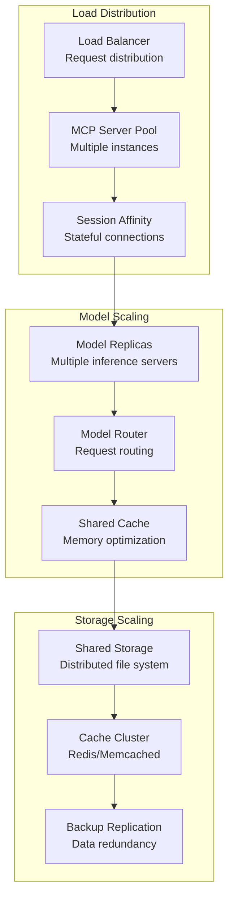
```mermaid
graph TB
    subgraph "Load Distribution"
        LOAD_BALANCER[Load Balancer<br/>Request distribution]
        MCP_POOL[MCP Server Pool<br/>Multiple instances]
        SESSION_AFFINITY[Session Affinity<br/>Stateful connections]
    end
    
    subgraph "Model Scaling"
        MODEL_REPLICAS[Model Replicas<br/>Multiple inference servers]
        MODEL_ROUTER[Model Router<br/>Request routing]
        SHARED_CACHE[Shared Cache<br/>Memory optimization]
    end
    
    subgraph "Storage Scaling"
        SHARED_STORAGE[Shared Storage<br/>Distributed file system]
        CACHE_CLUSTER[Cache Cluster<br/>Redis/Memcached]
        BACKUP_REPLICATION[Backup Replication<br/>Data redundancy]
    end
    
    LOAD_BALANCER --> MCP_POOL
    MCP_POOL --> SESSION_AFFINITY
    SESSION_AFFINITY --> MODEL_REPLICAS
    
    MODEL_REPLICAS --> MODEL_ROUTER
    MODEL_ROUTER --> SHARED_CACHE
    SHARED_CACHE --> SHARED_STORAGE
    
    SHARED_STORAGE --> CACHE_CLUSTER
    CACHE_CLUSTER --> BACKUP_REPLICATION
```

### Vertical Scaling Considerations
- **Memory Requirements**: Model size + conversation history + file cache
- **CPU Usage**: Inference computation + file I/O operations
- **GPU Resources**: Model inference acceleration (vLLM, MLX)
- **Storage I/O**: Memory file access patterns and throughput

## Security Considerations

### Network Security
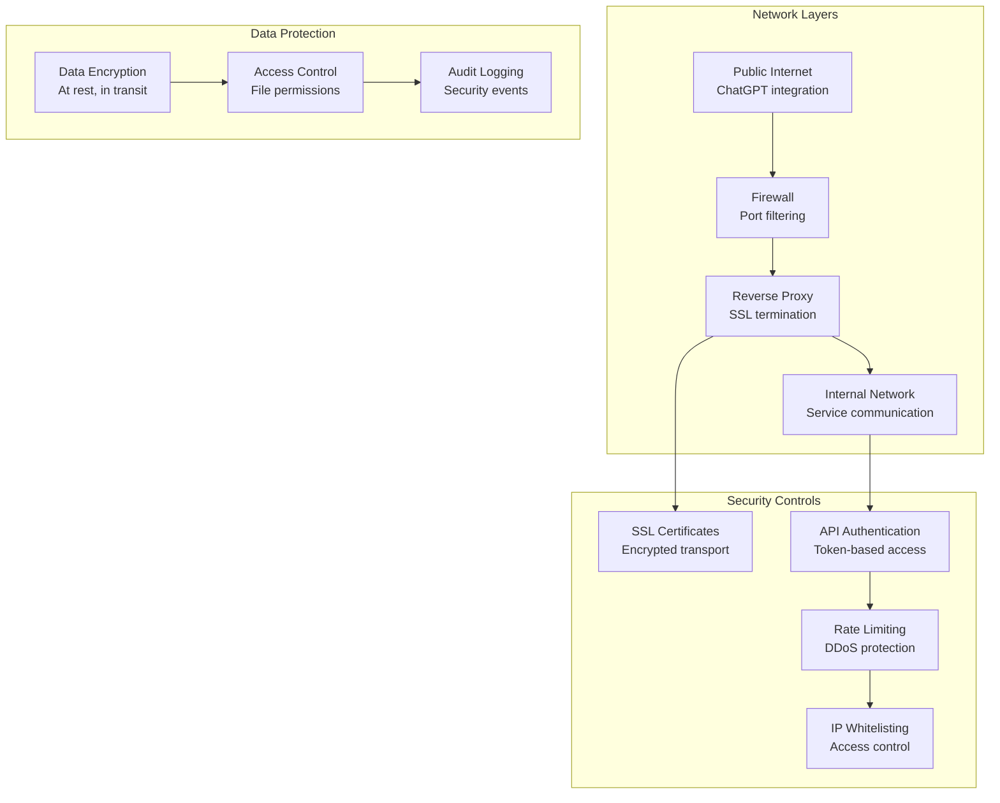
```mermaid
graph TB
    subgraph "Network Layers"
        PUBLIC[Public Internet<br/>ChatGPT integration]
        FIREWALL[Firewall<br/>Port filtering]
        REVERSE_PROXY[Reverse Proxy<br/>SSL termination]
        INTERNAL[Internal Network<br/>Service communication]
    end
    
    subgraph "Security Controls"
        SSL_CERT[SSL Certificates<br/>Encrypted transport]
        API_AUTH[API Authentication<br/>Token-based access]
        RATE_LIMIT[Rate Limiting<br/>DDoS protection]
        IP_WHITELIST[IP Whitelisting<br/>Access control]
    end
    
    subgraph "Data Protection"
        ENCRYPTION[Data Encryption<br/>At rest, in transit]
        ACCESS_CONTROL[Access Control<br/>File permissions]
        AUDIT_LOG[Audit Logging<br/>Security events]
    end
    
    PUBLIC --> FIREWALL
    FIREWALL --> REVERSE_PROXY
    REVERSE_PROXY --> INTERNAL
    
    REVERSE_PROXY --> SSL_CERT
    INTERNAL --> API_AUTH
    API_AUTH --> RATE_LIMIT
    RATE_LIMIT --> IP_WHITELIST
    
    ENCRYPTION --> ACCESS_CONTROL
    ACCESS_CONTROL --> AUDIT_LOG
```

### Application Security
- **Input Validation**: All MCP tool parameters and user inputs
- **Path Traversal Prevention**: Restrict file access to memory directory
- **Code Execution Sandboxing**: Python execution with restricted imports
- **Privacy Filters**: Content filtering before model processing
- **Credential Management**: Secure storage of API keys and tokens

## Next Steps

For implementation and operation:
- [API Architecture](./api-architecture.md) - API design and protocols
- [Memory Connectors Architecture](./memory-connectors-architecture.md) - Data integration
- [Component Architecture](./component-architecture.md) - System component details