# MCP Server Architecture

This document details the Model Context Protocol (MCP) server implementation, transport layers, and client integration patterns.

## MCP Server Overview

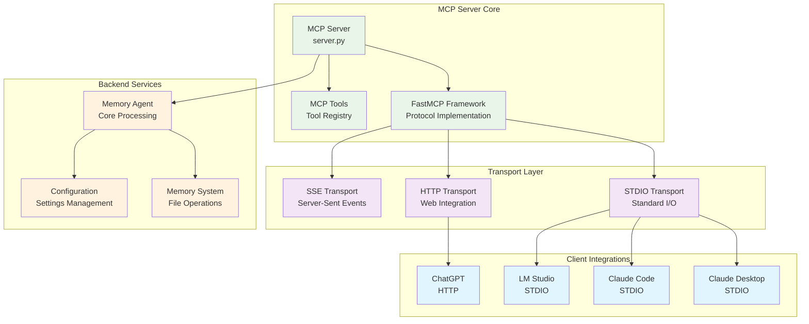

## MCP Protocol Implementation

### FastMCP Framework Integration
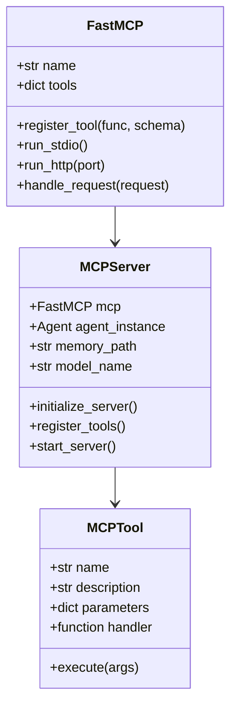

### Tool Registration System
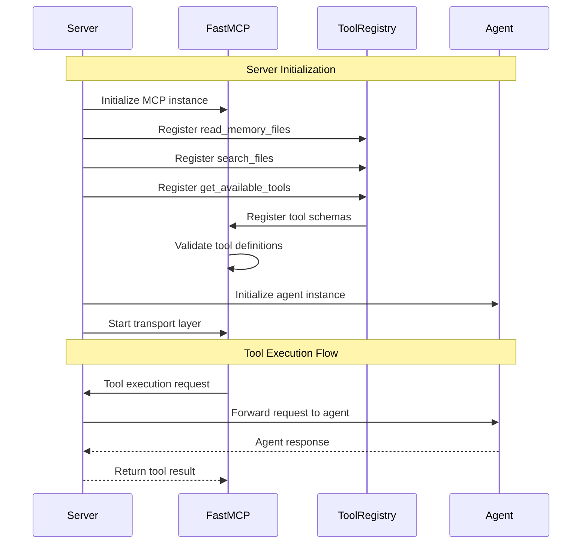

## Transport Layer Architecture

### STDIO Transport (Primary)
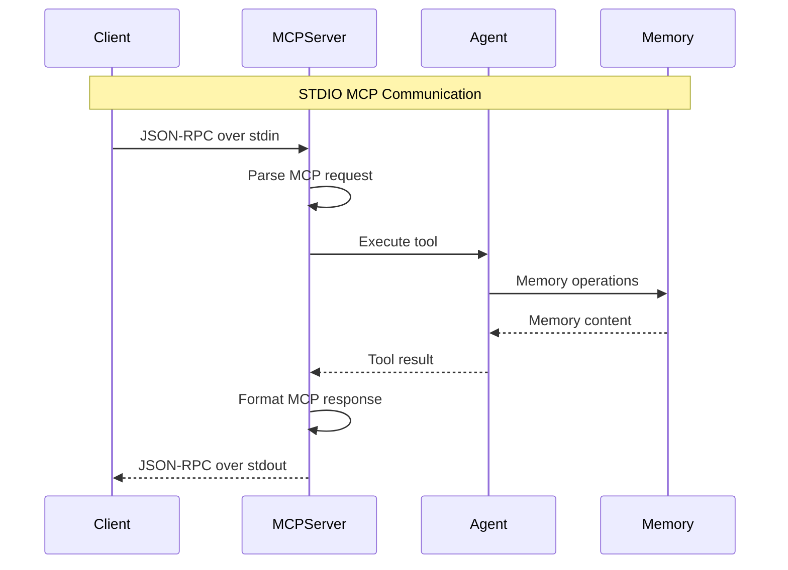

**STDIO Transport Features:**
- JSON-RPC 2.0 protocol compliance
- Bidirectional communication over stdin/stdout
- Native support in Claude Desktop, Claude Code, LM Studio
- Low latency, direct process communication
- Automatic process lifecycle management

### HTTP Transport (ChatGPT Integration)
```mermaid
graph TB
    subgraph "HTTP MCP Server"
        HTTP_SERVER[HTTP Server<br/>mcp_http_server.py]
        MCP_ENDPOINT[/mcp Endpoint<br/>MCP Protocol Handler]
        CORS[CORS Handler<br/>Cross-Origin Support]
    end
    
    subgraph "Request Processing"
        REQ_PARSER[Request Parser<br/>HTTP to MCP]
        MCP_PROCESSOR[MCP Processor<br/>Tool Execution]
        RESP_FORMATTER[Response Formatter<br/>MCP to HTTP]
    end
    
    subgraph "External Access"
        NGROK[ngrok Tunnel<br/>Public Access]
        CHATGPT_CLIENT[ChatGPT Client<br/>Developer Mode]
    end
    
    HTTP_SERVER --> MCP_ENDPOINT
    HTTP_SERVER --> CORS
    MCP_ENDPOINT --> REQ_PARSER
    REQ_PARSER --> MCP_PROCESSOR
    MCP_PROCESSOR --> RESP_FORMATTER
    
    NGROK --> HTTP_SERVER
    CHATGPT_CLIENT --> NGROK
```

**HTTP Transport Configuration:**
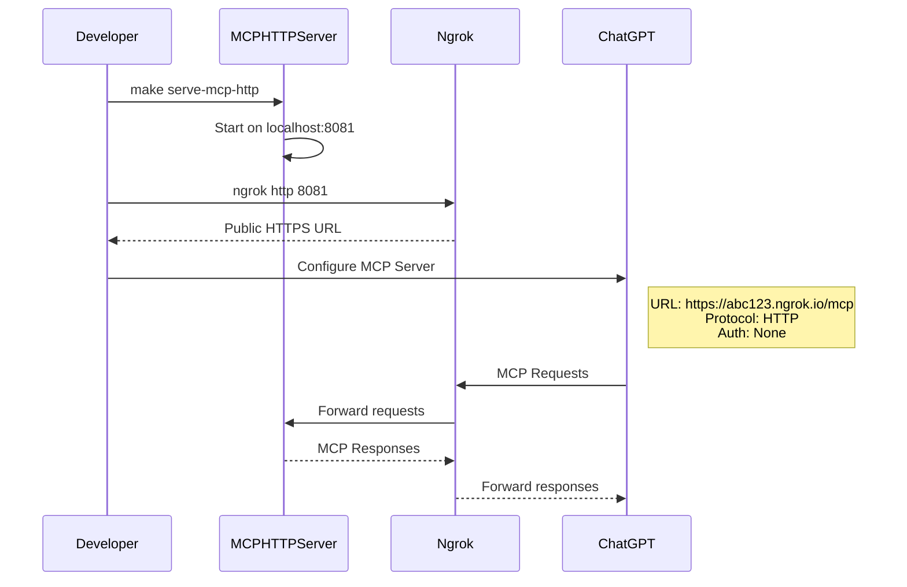

## MCP Tool Implementations

### Tool Schema Definition
```mermaid
classDiagram
    class MCPToolSchema {
        +str name
        +str description
        +dict parameters
        +list required
        +validate_input(args)
    }
    
    class ReadMemoryTool {
        +name: "read_memory_files"
        +description: "Read memory markdown files"
        +parameters: {files: array}
        +handler: read_memory_handler
    }
    
    class SearchFilesTool {
        +name: "search_files"
        +description: "Search memory files"
        +parameters: {query: str, max_results: int}
        +handler: search_files_handler
    }
    
    class AvailableToolsTool {
        +name: "get_available_tools" 
        +description: "List available tools"
        +parameters: {}
        +handler: available_tools_handler
    }
    
    MCPToolSchema <|-- ReadMemoryTool
    MCPToolSchema <|-- SearchFilesTool  
    MCPToolSchema <|-- AvailableToolsTool
```

### Tool Execution Pipeline
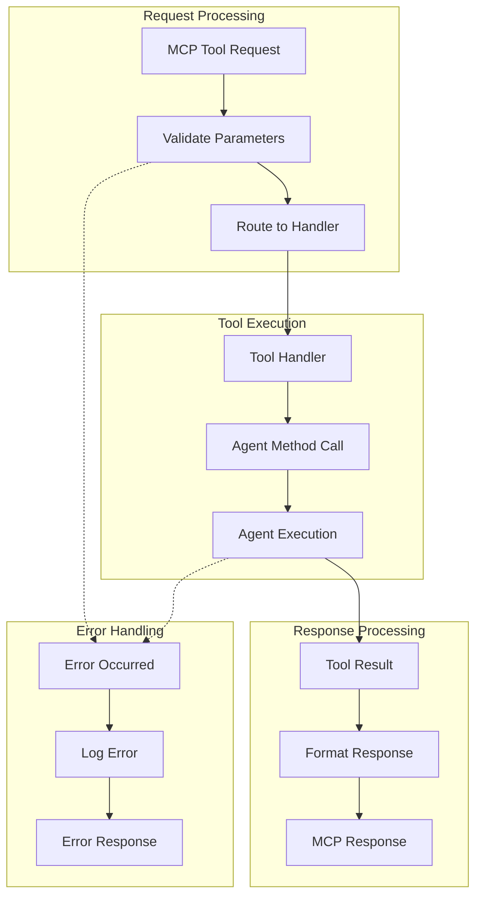

### Read Memory Files Tool
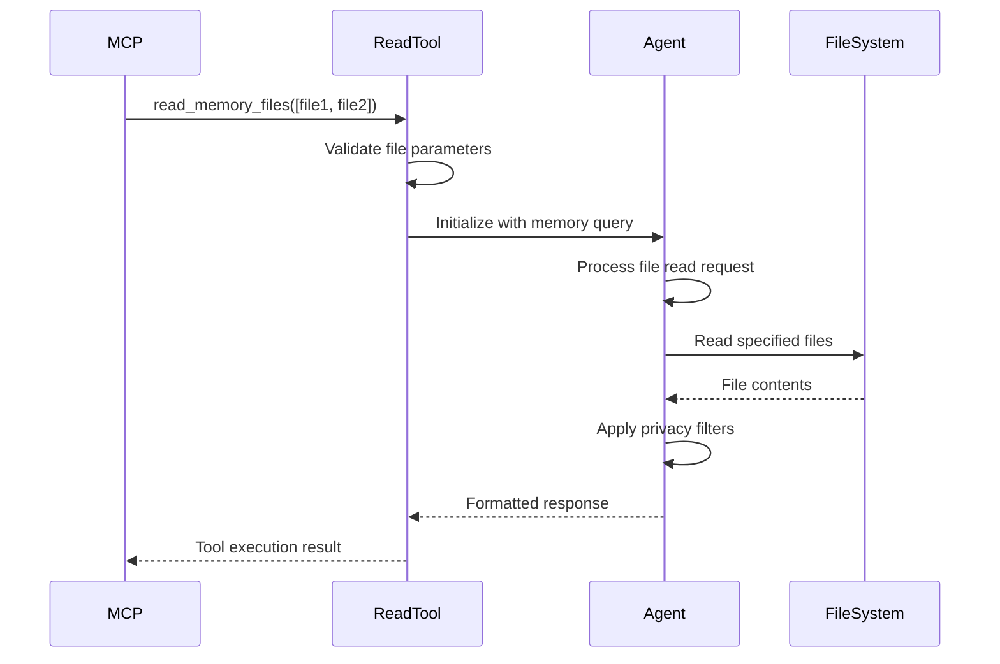

### Search Files Tool
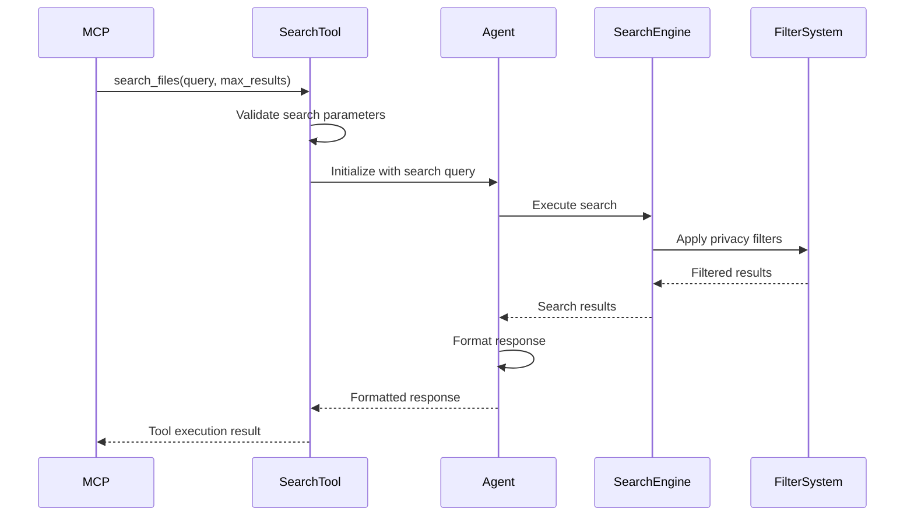

## Configuration Management

### Server Configuration
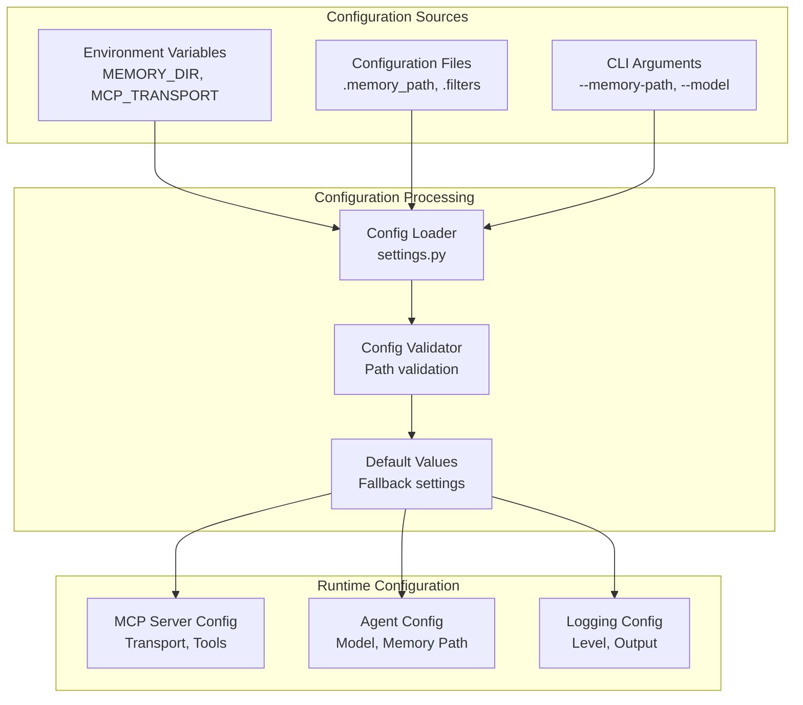

### Memory Path Resolution
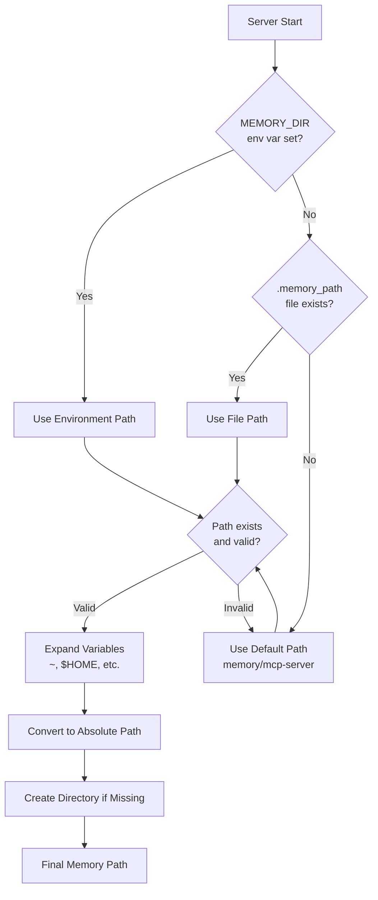

## Client Integration Patterns

### Claude Desktop Integration
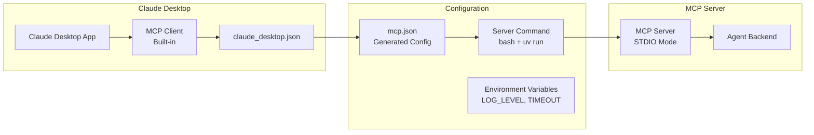

**Claude Desktop Configuration Example:**
```json
{
  "mcpServers": {
    "memory-agent-stdio": {
      "command": "bash",
      "args": ["-lc", "cd /path/to/repo && uv run python mcp_server/server.py"],
      "env": {
        "FASTMCP_LOG_LEVEL": "INFO",
        "MCP_TRANSPORT": "stdio"
      },
      "timeout": 600000
    }
  }
}
```

### ChatGPT Integration Pattern
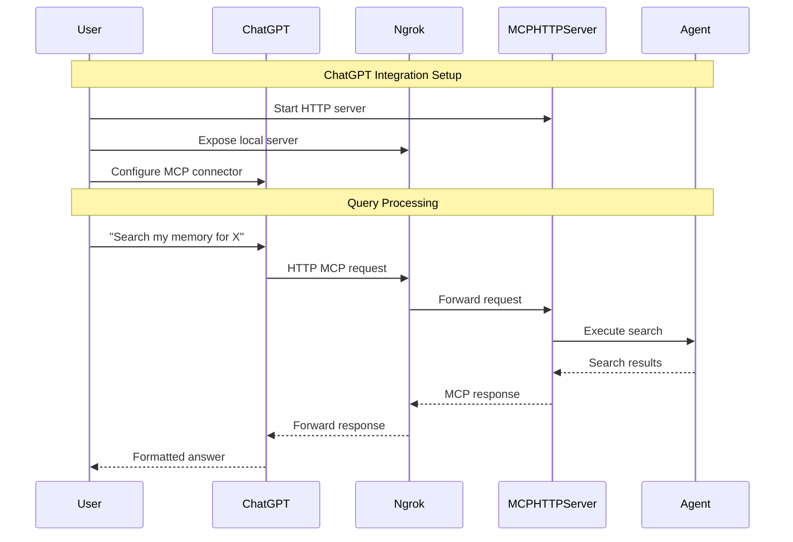

## Error Handling and Logging

### Error Handling Strategy
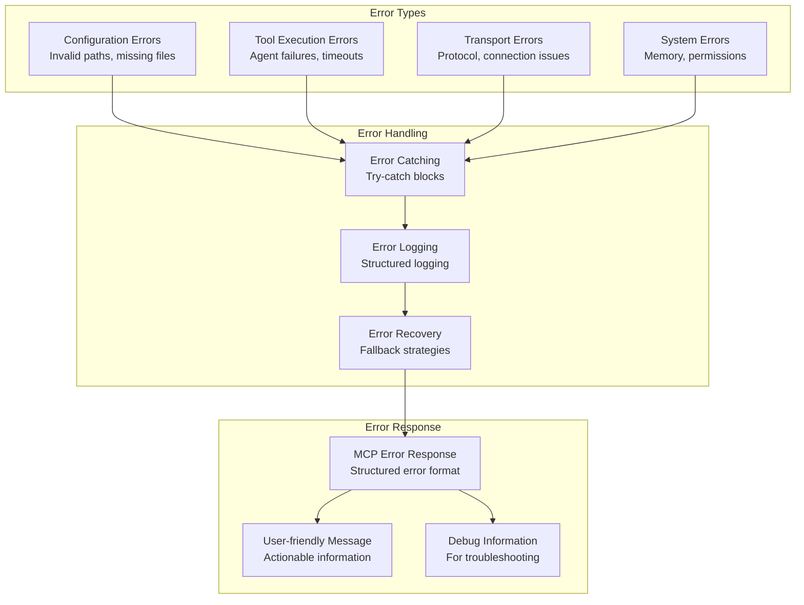

### Logging Architecture
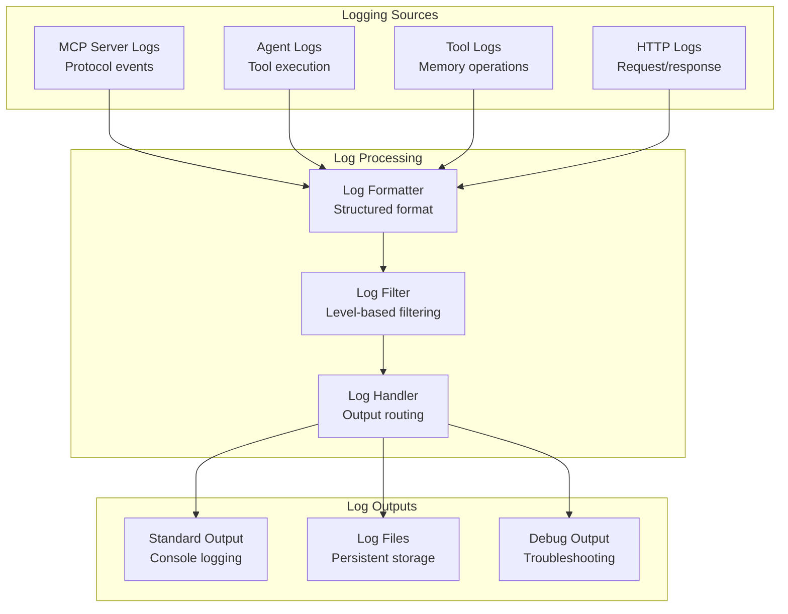

## Performance and Scalability

### Request Processing Performance
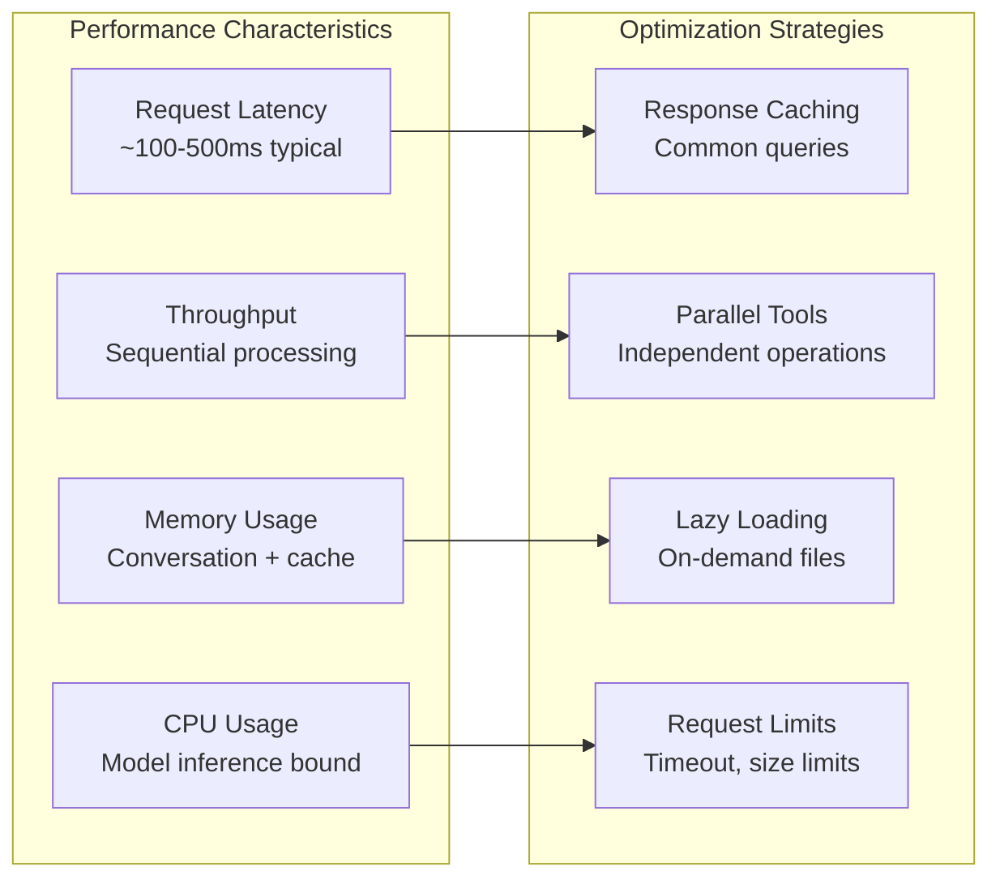

### Scaling Considerations
- **Single Process**: Current design is single-process, single-threaded
- **Memory Limits**: Bounded by model context window and conversation history
- **Concurrent Clients**: Multiple clients can connect to same server instance
- **File System**: Performance scales with memory directory size and structure

## Security Considerations

### Security Model
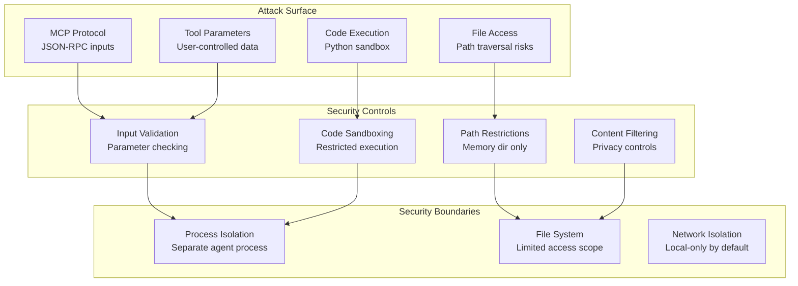

## Next Steps

For related architecture documentation:
- [Agent Architecture](./agent-architecture.md) - Agent implementation details
- [Memory System Architecture](./memory-system-architecture.md) - Memory organization
- [API Architecture](./api-architecture.md) - API design patterns
- [Deployment Architecture](./deployment-architecture.md) - Deployment configurations