# Memory Connectors Architecture

This document details the architecture of the memory connectors system, which handles data integration from various external sources into the mem-agent memory format.

## Memory Connectors Overview


## Connector Framework Architecture

### Base Connector Interface


### Connector Registry System


### Plugin Architecture


## Individual Connector Architectures

### ChatGPT History Connector


**ChatGPT Connector Implementation:**


### GitHub Live Connector


**GitHub Connector Architecture:**


### Notion Workspace Connector

```mermaid
flowchart TD
    subgraph "Notion Export Processing"
        NOTION_ZIP[Notion Export ZIP]
        EXTRACT_STRUCTURE[Extract Directory Structure]
        PAGE_HIERARCHY[Parse Page Hierarchy]
        BLOCK_CONTENT[Process Block Content]
    end
    
    subgraph "Content Transformation"
        NOTION_MARKDOWN[Notion Markdown<br/>Custom format]
        STANDARD_MARKDOWN[Standard Markdown<br/>Obsidian-compatible]
        MEDIA_HANDLING[Media File Handling<br/>Images, attachments]
        LINK_CONVERSION[Link Conversion<br/>Notion links → Wikilinks]
    end
    
    subgraph "Workspace Organization"
        DATABASE_PAGES[Database Pages<br/>Structured data]
        REGULAR_PAGES[Regular Pages<br/>Free-form content]
        NESTED_STRUCTURE[Nested Structure<br/>Parent-child relationships]
        PROPERTY_EXTRACTION[Property Extraction<br/>Metadata, tags]
    end
    
    subgraph "Memory Integration"
        WORKSPACE_ENTITY[Workspace Entity<br/>Main organization]
        PAGE_ENTITIES[Page Entities<br/>Individual pages]
        DATABASE_ENTITIES[Database Entities<br/>Structured data]
        CROSS_REFS[Cross-references<br/>Inter-page relationships]
    end
    
    NOTION_ZIP --> EXTRACT_STRUCTURE
    EXTRACT_STRUCTURE --> PAGE_HIERARCHY
    PAGE_HIERARCHY --> BLOCK_CONTENT
    BLOCK_CONTENT --> NOTION_MARKDOWN
    
    NOTION_MARKDOWN --> STANDARD_MARKDOWN
    STANDARD_MARKDOWN --> MEDIA_HANDLING
    MEDIA_HANDLING --> LINK_CONVERSION
    LINK_CONVERSION --> DATABASE_PAGES
    
    DATABASE_PAGES --> REGULAR_PAGES
    REGULAR_PAGES --> NESTED_STRUCTURE
    NESTED_STRUCTURE --> PROPERTY_EXTRACTION
    PROPERTY_EXTRACTION --> WORKSPACE_ENTITY
    
    WORKSPACE_ENTITY --> PAGE_ENTITIES
    PAGE_ENTITIES --> DATABASE_ENTITIES
    DATABASE_ENTITIES --> CROSS_REFS
```


### Google Docs Connector


## Data Processing Pipelines

### Categorization Systems


### Entity Extraction Pipeline


### Memory File Generation


## Memory Wizard Integration

### Interactive Wizard Architecture


### Wizard State Management


## Configuration and Customization

### Connector Configuration Schema


### Custom Category Definition
```yaml
# Custom categorization configuration
categories:
  ai_research:
    keywords: ["artificial intelligence", "machine learning", "neural networks", "AI", "ML"]
    patterns: ["\\bAI\\b", "\\bML\\b", "deep learning"]
    description: "Discussions about AI and machine learning"
    
  programming:
    keywords: ["code", "programming", "development", "software", "coding"]
    patterns: ["\\bAPI\\b", "function", "class", "method"]
    description: "Programming and software development topics"
    
  product_strategy:
    keywords: ["product", "strategy", "roadmap", "features", "planning"]
    patterns: ["product manager", "PM", "requirements"]
    description: "Product management and strategy discussions"

# Processing options
processing:
  categorization_method: "hybrid"  # keyword|ai|hybrid
  embedding_model: "tfidf"  # tfidf|lmstudio
  min_conversation_length: 50
  max_conversations: 1000
  enable_ai_categorization: true
  confidence_threshold: 0.7
```

## Performance and Optimization

### Processing Performance


### Scalability Considerations
- **Large Datasets**: Streaming processing for multi-GB exports
- **API Rate Limits**: Exponential backoff and retry strategies
- **Memory Usage**: Incremental processing and garbage collection
- **Processing Time**: Progress tracking and user feedback
- **Error Resilience**: Checkpoint/resume capabilities for long operations

## Quality Assurance and Testing

### Data Quality Metrics


### Testing Strategy


## Future Extensions

### Planned Connectors
- **Slack Workspaces**: Team communication integration
- **Discord Servers**: Community discussion processing
- **Email Archives**: Personal email integration
- **Twitter/X Archives**: Social media data processing
- **Obsidian Vaults**: Direct Obsidian integration
- **Roam Research**: Graph database integration

### Advanced Features
- **Real-time Synchronization**: Live data updates
- **Incremental Processing**: Delta updates only
- **Multi-language Support**: Non-English content processing
- **Custom Entity Types**: User-defined entity categories
- **Advanced Analytics**: Memory usage statistics and insights

## Next Steps

For related architecture information:
- [System Overview](./system-overview.md) - Overall system architecture
- [Data Flow Architecture](./data-flow-architecture.md) - Data processing flows
- [Memory System Architecture](./memory-system-architecture.md) - Memory organization
- [API Architecture](./api-architecture.md) - API integration patterns