# Memory System Architecture

This document details the memory storage, organization, and retrieval system that forms the core of the mem-agent-mcp platform.

## Memory System Overview

```mermaid
graph TB
    subgraph "Memory Organization"
        USER[user.md<br/>Central Profile]
        ENTITIES[entities/<br/>Entity Directory]
        TOPICS[topics/<br/>Auto-generated Topics]
        CONVS[conversations/<br/>Imported Conversations]
    end
    
    subgraph "Memory Structure"
        WIKILINKS[Wikilink Navigation<br/>[[entity/file.md]]]
        RELATIONSHIPS[Relationship Mapping<br/>Bidirectional Links]
        METADATA[Metadata Management<br/>Attributes & Properties]
    end
    
    subgraph "Memory Operations"
        READ[Read Operations<br/>File Content Access]
        SEARCH[Search Operations<br/>Pattern Matching]
        INDEX[Index Operations<br/>Relationship Queries]
        FILTER[Filter Operations<br/>Privacy Controls]
    end
    
    subgraph "Storage Layer"
        FILESYSTEM[File System<br/>Markdown Files]
        CACHE[Content Cache<br/>LRU Cache]
        BACKUP[Backup System<br/>Version Control]
    end
    
    USER --> ENTITIES
    ENTITIES --> TOPICS
    ENTITIES --> CONVS
    
    USER --> WIKILINKS
    WIKILINKS --> RELATIONSHIPS
    RELATIONSHIPS --> METADATA
    
    READ --> FILESYSTEM
    SEARCH --> FILESYSTEM
    INDEX --> CACHE
    FILTER --> CACHE
    
    FILESYSTEM --> BACKUP
    
    %% Styling
    classDef organization fill:#e8f5e8
    classDef structure fill:#f3e5f5
    classDef operations fill:#fff3e0
    classDef storage fill:#e1f5fe
    
    class USER,ENTITIES,TOPICS,CONVS organization
    class WIKILINKS,RELATIONSHIPS,METADATA structure
    class READ,SEARCH,INDEX,FILTER operations
    class FILESYSTEM,CACHE,BACKUP storage
```

## Memory Organization Patterns

### Obsidian-Style Structure
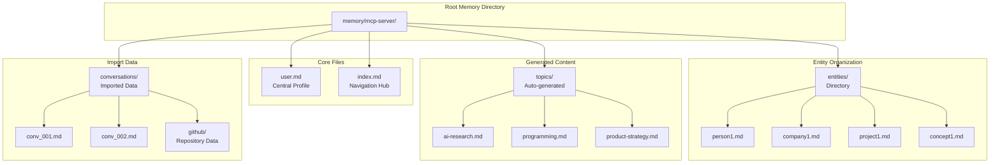

### File Structure Specifications

#### User Profile Structure (`user.md`)
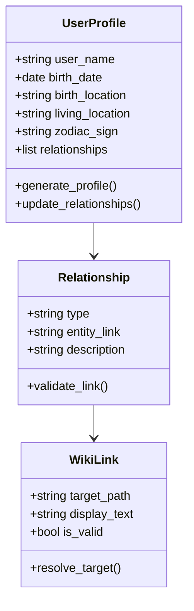

**Example user.md Structure:**
```markdown
# User Information
- user_name: John Doe
- birth_date: 1990-01-01
- birth_location: New York, USA
- living_location: San Francisco, CA
- zodiac_sign: Capricorn

## User Relationships
- company: [[entities/acme_corp.md]]
- manager: [[entities/jane_smith.md]]
- project: [[entities/ai_project.md]]
- hobby: [[entities/photography.md]]

## Recent Activity
- Last conversation: 2024-01-15
- Active projects: 3
- Memory entries: 47
```

#### Entity File Structure
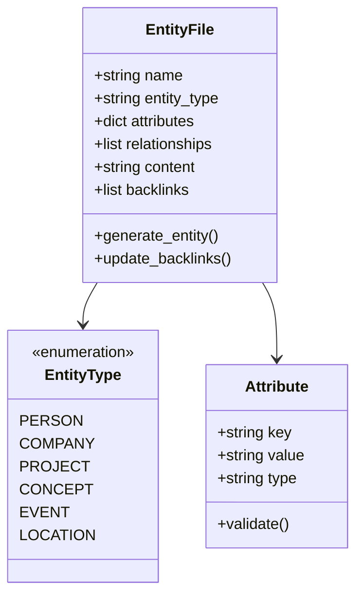

**Example Entity File Structure:**
```markdown
# Jane Smith
- relationship: Manager
- department: Engineering
- start_date: 2019-03-15
- email: jane.smith@company.com
- skills: ["Python", "Machine Learning", "Team Leadership"]

## Background
Jane has been leading the AI research team since 2019. She has extensive experience in machine learning and has published several papers on neural networks.

## Projects
- [[entities/ai_project.md]] - Current project lead
- [[entities/research_initiative.md]] - Technical advisor

## Related Conversations
- [[conversations/weekly_standup_2024_01_15.md]]
- [[conversations/project_planning_2024_01_10.md]]
```

## Wikilink System Architecture

### Link Resolution System
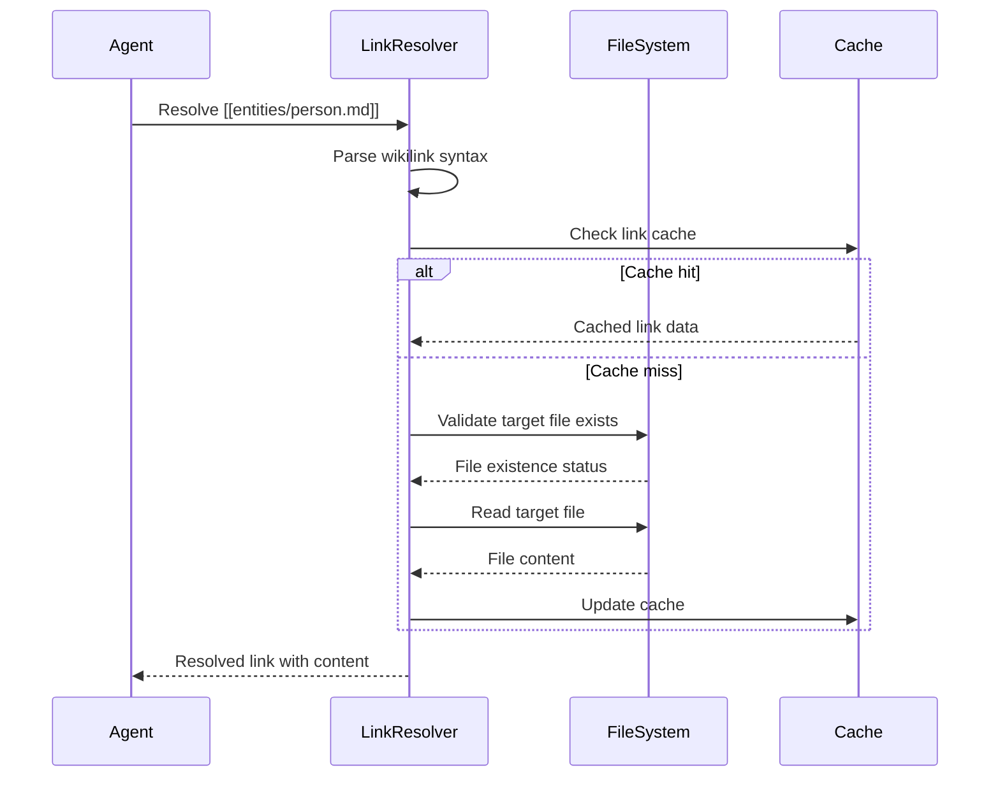

### Bidirectional Link Management
```mermaid
graph TB
    subgraph "Link Creation"
        DETECT[Detect New Wikilink<br/>[[entities/file.md]]]
        VALIDATE[Validate Target Exists<br/>File system check]
        CREATE[Create Forward Link<br/>Source → Target]
    end
    
    subgraph "Backlink Generation"
        SCAN[Scan All Files<br/>Find references]
        EXTRACT[Extract Wikilinks<br/>Parse markdown]
        BACKLINK[Generate Backlinks<br/>Target ← Sources]
    end
    
    subgraph "Link Maintenance"
        VALIDATE_LINKS[Validate All Links<br/>Check file existence]
        UPDATE_INDEX[Update Link Index<br/>Relationship mapping]
        REPAIR[Repair Broken Links<br/>Suggest alternatives]
    end
    
    DETECT --> VALIDATE
    VALIDATE --> CREATE
    CREATE --> SCAN
    
    SCAN --> EXTRACT
    EXTRACT --> BACKLINK
    BACKLINK --> VALIDATE_LINKS
    
    VALIDATE_LINKS --> UPDATE_INDEX
    UPDATE_INDEX --> REPAIR
```

### Link Types and Semantics
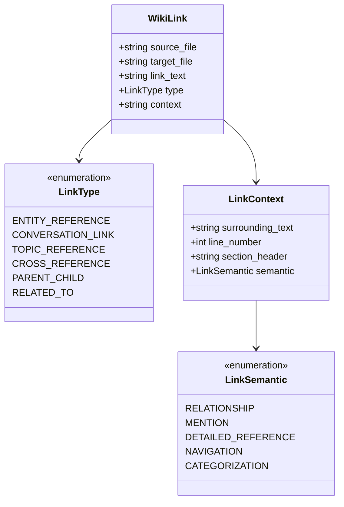

## Memory Search Architecture

### Search Engine Implementation
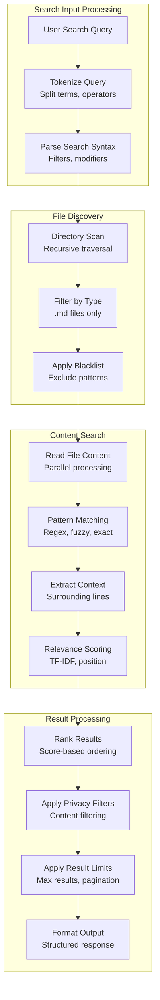

### Search Query Types
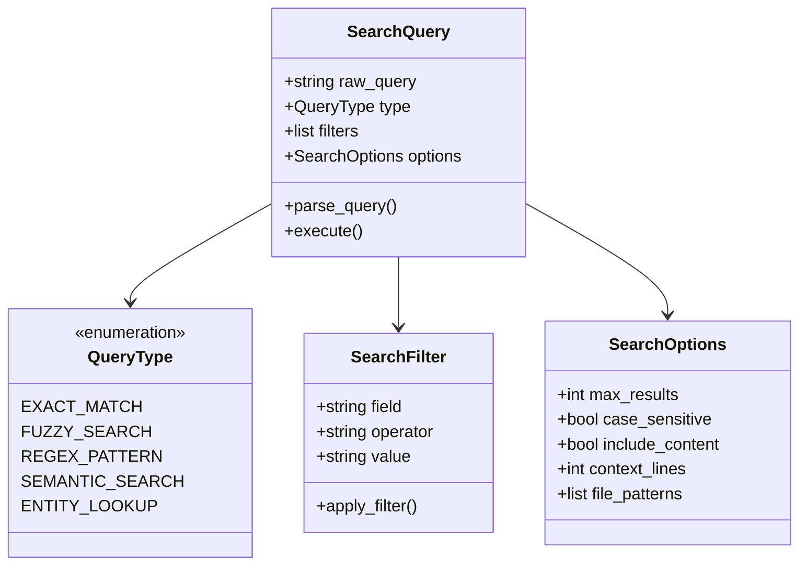

**Search Query Examples:**
```bash
# Exact phrase search
"machine learning project"

# Entity-specific search
entity:person manager

# File type filtering
type:conversation topic:ai

# Regex pattern search
pattern:"\b\d{4}-\d{2}-\d{2}\b"  # Date patterns

# Combined filters
"project planning" entity:company created:2024-01
```

### Search Result Ranking
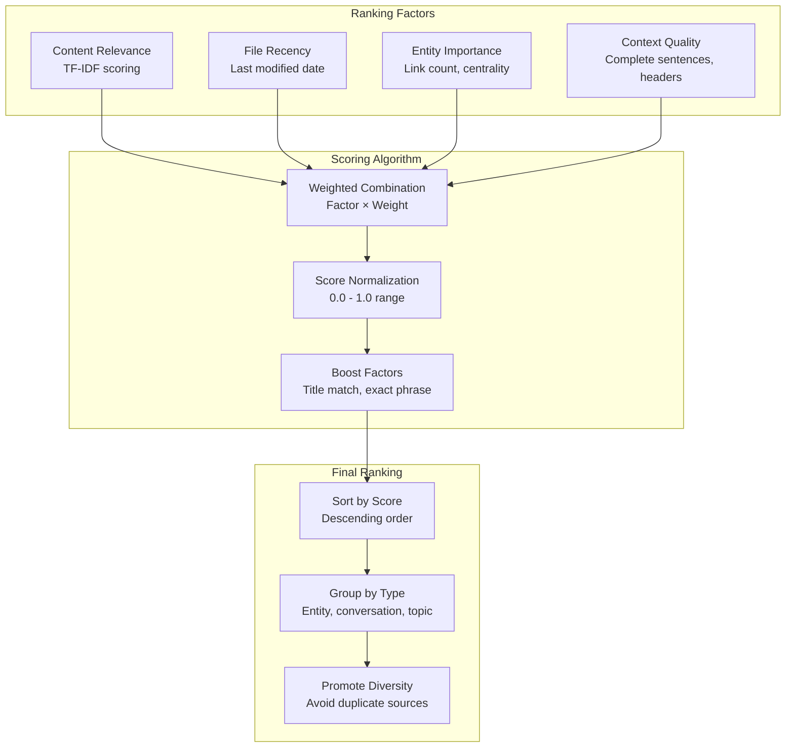

## Privacy and Filtering System

### Content Filter Architecture
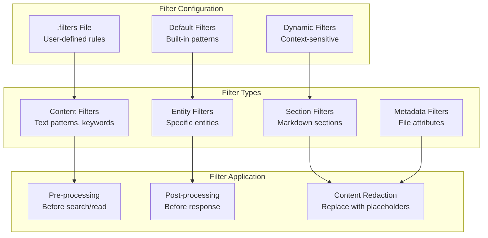

### Filter Rule System
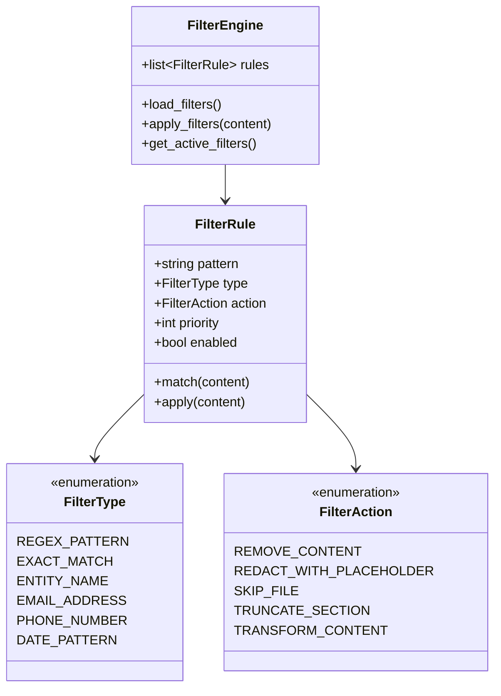

**Example Filter Configuration:**
```yaml
# Content privacy filters
filters:
  - pattern: "\b\d{3}-\d{2}-\d{4}\b"  # SSN
    type: regex_pattern
    action: redact_with_placeholder
    placeholder: "[SSN]"
    
  - pattern: "email"
    type: exact_match
    action: remove_content
    
  - entity: "confidential_project"
    type: entity_name
    action: skip_file
    
  - section: "## Private Notes"
    type: section_filter
    action: truncate_section
```

## Memory Connector Integration

### Data Import Pipeline
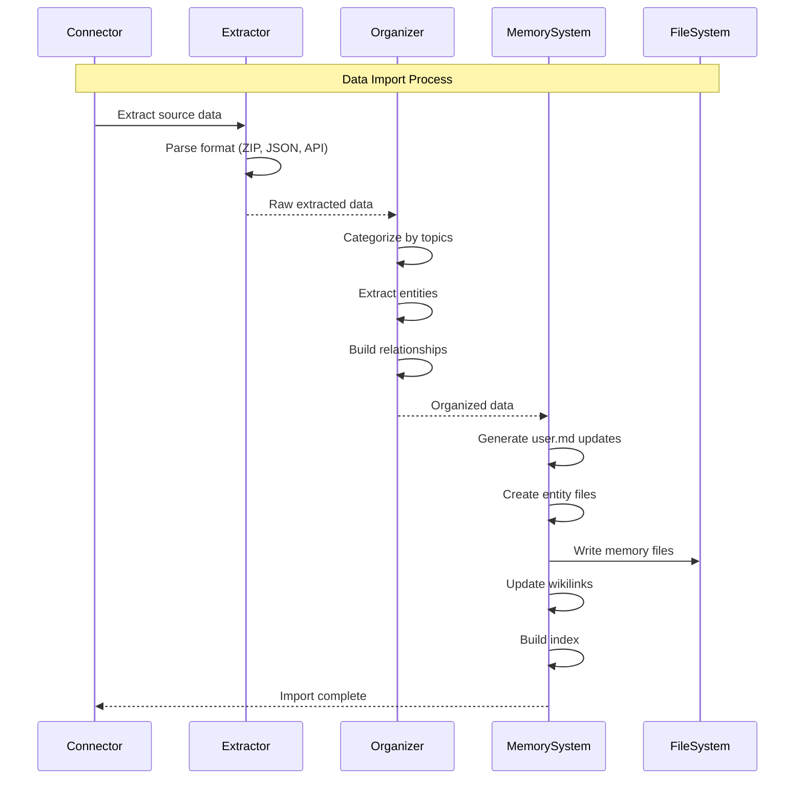

### Entity Extraction and Relationship Mapping
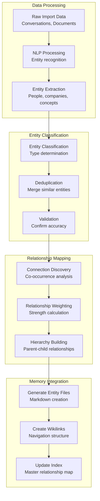

## Performance and Optimization

### Caching Strategy
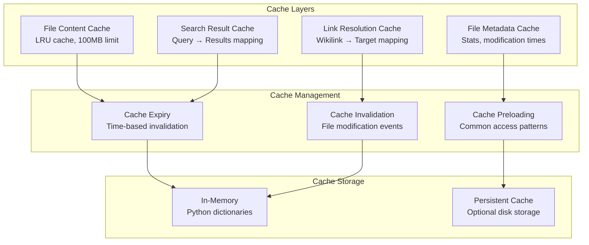

### File System Optimization
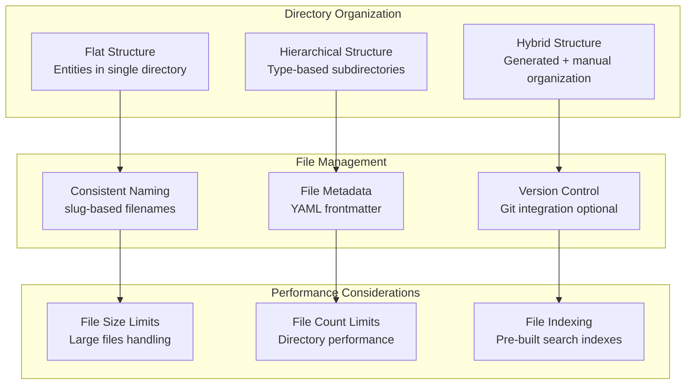

## Data Consistency and Integrity

### Consistency Guarantees
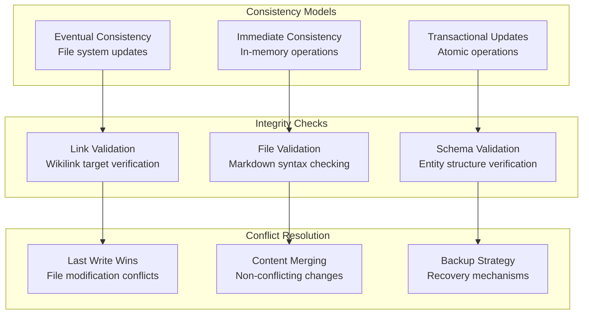

### Backup and Recovery
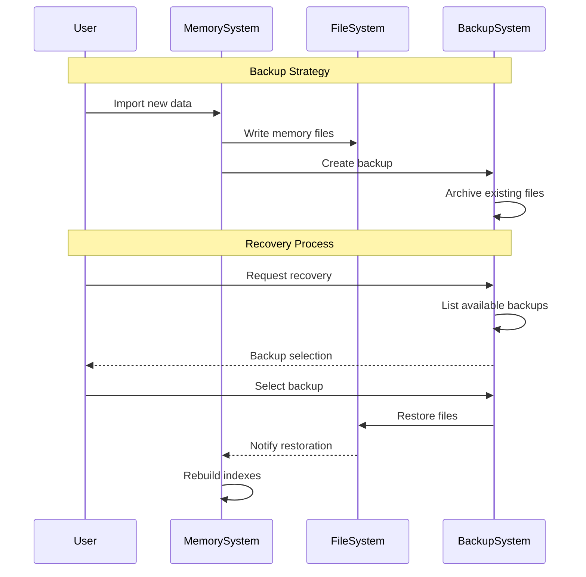

## Next Steps

For related architecture documentation:
- [Agent Architecture](./agent-architecture.md) - Agent processing and tools
- [Memory Connectors Architecture](./memory-connectors-architecture.md) - Data import systems
- [Data Flow Architecture](./data-flow-architecture.md) - Information processing flows
- [API Architecture](./api-architecture.md) - External integration patterns