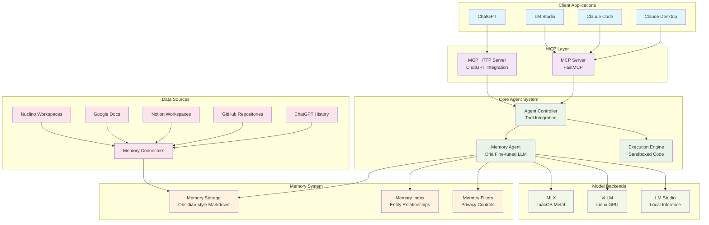

# System Overview Architecture

This document provides a high-level overview of the mem-agent-mcp system architecture, components, and their relationships.

## System Purpose

The mem-agent-mcp is a sophisticated memory management system that combines:
- A specialized LLM (Large Language Model) fine-tuned for memory operations
- Model Context Protocol (MCP) server for integration with AI assistants
- Comprehensive memory connectors for various data sources
- Obsidian-style markdown memory management

## High-Level System Architecture

## Key System Components

### 1. Client Applications Layer
- **Claude Desktop**: Anthropic's desktop application with MCP support
- **Claude Code**: Terminal-based coding assistant
- **ChatGPT**: Web-based integration via HTTP MCP server
- **LM Studio**: Local model management and inference

### 2. MCP (Model Context Protocol) Layer
- **MCP Server**: STDIO-based server using FastMCP framework
- **MCP HTTP Server**: HTTP wrapper for web-based integrations
- **Transport Protocols**: Support for STDIO and HTTP transports

### 3. Core Agent System
- **Memory Agent**: Dria fine-tuned LLM specialized for memory operations
- **Agent Controller**: Orchestrates tool execution and model interactions
- **Execution Engine**: Sandboxed Python code execution for memory operations

### 4. Memory System
- **Memory Storage**: Obsidian-style markdown files with wikilink navigation
- **Memory Index**: Entity relationships and topic organization
- **Memory Filters**: Privacy controls and content filtering

### 5. Data Sources & Connectors
- **Memory Connectors**: Pluggable system for external data integration
- **Export-based**: ChatGPT, Notion, Nuclino (ZIP/JSON imports)
- **Live API**: GitHub repositories, Google Docs (real-time sync)

### 6. Model Backends
- **MLX**: Apple Metal acceleration for macOS
- **vLLM**: High-performance inference for Linux with GPU
- **LM Studio**: Cross-platform local model management

## System Characteristics

### Architecture Patterns
- **Modular Design**: Clear separation between components
- **Plugin Architecture**: Extensible memory connector system
- **Protocol Agnostic**: Multiple transport protocols (STDIO, HTTP)
- **Multi-Backend**: Support for various inference backends

### Key Features
- **Privacy-First**: Local model execution and memory storage
- **Cross-Platform**: macOS (MLX) and Linux (vLLM) support
- **Extensible**: Plugin architecture for new data sources
- **Real-Time**: Live data integration from various platforms

### Data Flow Patterns
1. **Ingestion**: External data → Memory Connectors → Organized Memory
2. **Query**: Client → MCP Server → Agent → Memory System
3. **Response**: Memory Results → Agent Processing → Client Response

## Integration Points

### Upstream Integrations
- **Model Providers**: Local inference backends (MLX, vLLM, LM Studio)
- **Data Sources**: ChatGPT, GitHub, Notion, Google Docs, Nuclino

### Downstream Integrations  
- **AI Assistants**: Claude Desktop, Claude Code, ChatGPT
- **Development Tools**: LM Studio, terminal applications

## Next Steps

For detailed component documentation:
- [Component Architecture](./component-architecture.md) - Detailed component interactions
- [Data Flow Architecture](./data-flow-architecture.md) - Data processing pipelines
- [Agent Architecture](./agent-architecture.md) - Memory agent implementation